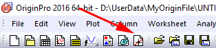
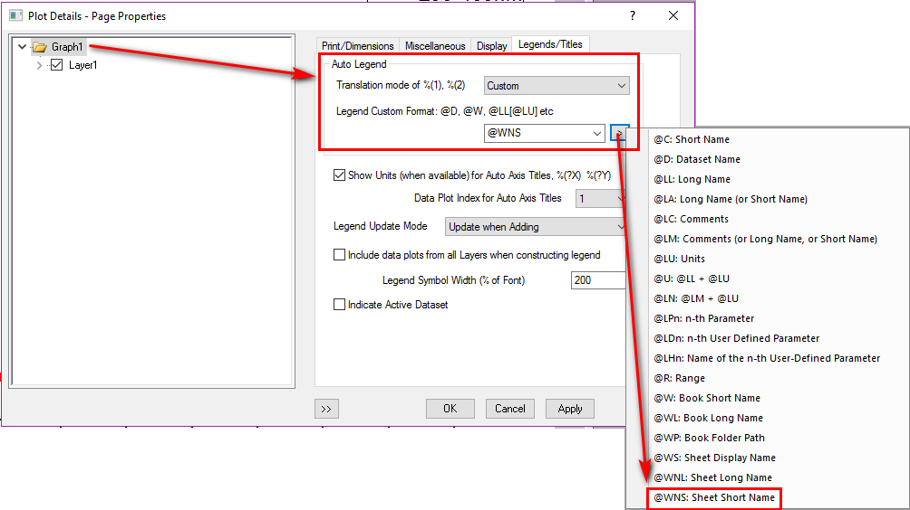
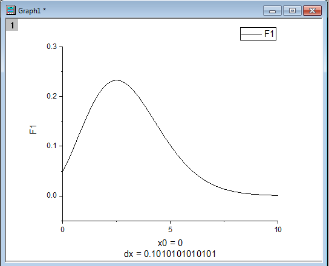

# Some Experience

## Enhanced digitizer

you can use the **Digitize Image** button on the **Standard** toolbar in [OriginLab](http://www.originlab.com/doc/Tutorials/enhanced-digitizer) or other [Engauge-digitizer](https://github.com/markummitchell/engauge-digitizer/releases)

## Add errorbar to your graph

<http://www.originlab.com/doc/Origin-Help/Add-ErrBar-to-Graph>

## 2D plot

如果图片锯齿很多，采用多画一些点来，平滑曲线

## Legend

## OriginLab Factorial Function

Attention:  Now the Origin 2017 have the `Fact(n)` function,  but it is only for integer

[Gamma Function](http://mathworld.wolfram.com/GammaFunction.html)

How to use Gammar function in OriginLab:
<http://www.originlab.com/doc/Quick-Help/use-gamma-function>

### Method 1

`OriginPro/Tools/Mathematica Link`

Using the function in Mathematica(because Mathematica can do that)

### Method 2

Cannot use Gamma function directly, but can make it by using `gammaln()`

<http://www.originlab.com/doc/OriginC/ref/gammaln>

Examle:StandardToolbar/New 2D plot/

`y(x)=3.01^x/exp(gammaln(x+1))`

