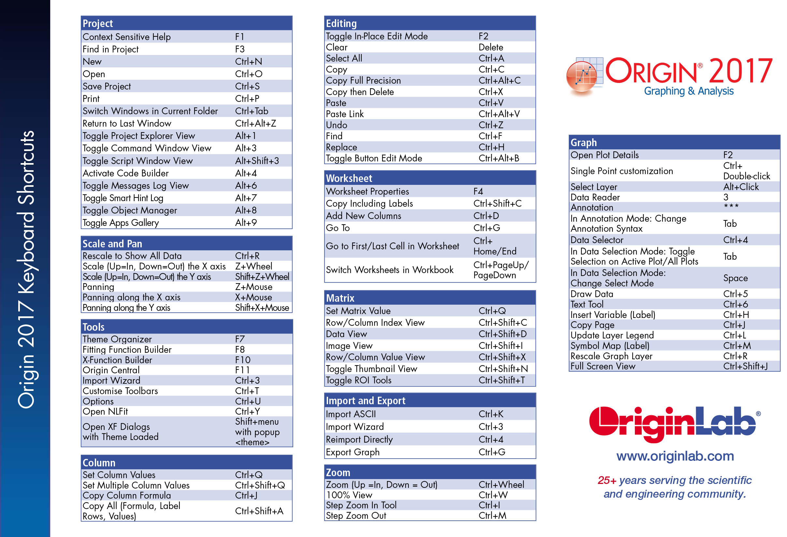
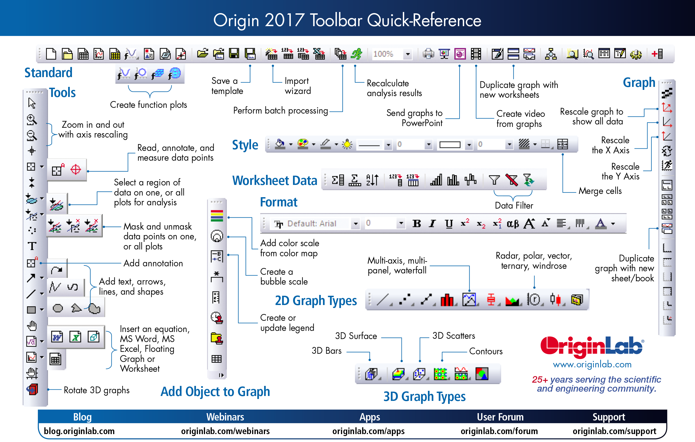

# 白东升Origin

origin主要功能: 数据绘图，数据分析
- 01-09数据窗口编辑
- 10-29数据绘图
- 30-58数据分析
- 59-65编程与扩展

[All Video](http://www.bilibili.com/video/av6372037/?from=search&seid=10655275167750123006)

Shortcuts
> 

Toolbar
> 