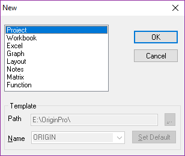

# Windows

File/New(Ctrl + N): 8 types,with **Workbook**, **Graph**, **Matrix**, you can set the Template

Save current window: Right click the window header, `Save as`…

Double click to change the Column Header, File/Save Template AS…

## Project

## Workbook

## Excel

## Graph

New Graph Layer:

Project Explorer(`Alt + 1`), Right click, New Window/Graph

- 1.Toolbar Graph/New Layer(axes)
- 2.Right click on the Graph Blank, New Layer(axes)

## Layout

## Notes

用于记录相关信息

E.g. 图形的绘图过程，数据分析结果，数据批注,etc 

## Matrix

## Function