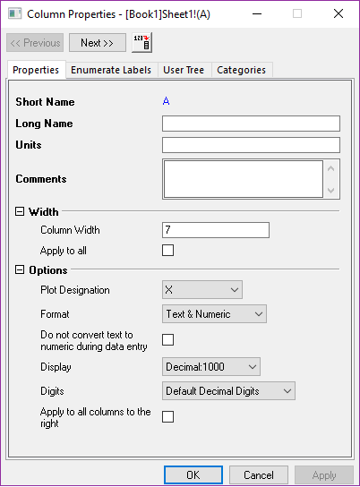
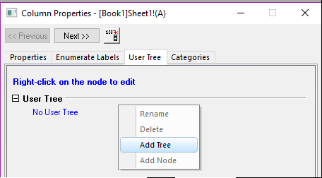

# Input data & column properties

## Input data

<kbd>Enter</kbd>切换焦点到下面的cell,
<kbd>Tab</kbd>切换焦点到右面的cell;

Origin默认32行2列，可以在最后一行按 <kbd>↓</kbd> 来增加新行

可以在一个cell的右下角拖动**Cross**来复制数据

## Column

Add New Columns: <kbd>Ctrl</kbd>+<kbd>D</kbd>

9 column properties: X, Y, Z, Label, Disregard, Y Error, X Error, Group, Subject
> G: Group; S: Subject. 很少用到

Column/Set As: 
> 
> 

Label: 给每个数据点添加标签

> 

如果选择多列，Context Menu/Set As会出现其他的选项，方便同时设置多列的类型, 比如XYXY, XYY

Worksheet Properties: <kbd>F4</kbd>

> 
> 

在workbook添加Sampling Interval行方法:
- 如上文的<kbd>F4</kbd>
- ContextMenu/View/Sampling Interval

选择某一个**Y**列, Column/Set Sampling Interval
> 

绘图的时候，会使用这时的**起点**和**间隔**来作为X坐标，而不使用左侧的**X**列

## Column Properties

Double Click on the Short-Name
>   

根据当前列的属性衍生出右边列的属性
> 

User Tree: 保存与当前列有关的信息，导入文件时，会存储有关的信息
> 