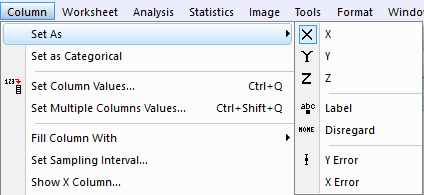
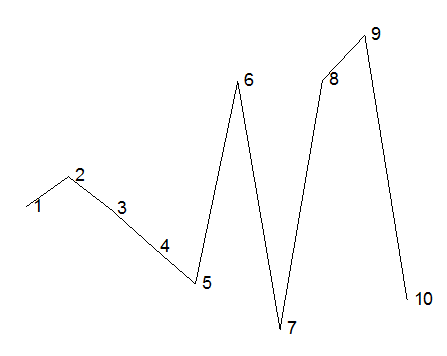
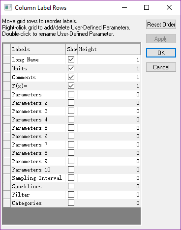

# Input data & set column properties

- [Input data & set column properties](#input-data-set-column-properties)
    - [9 kinds of plot properties in Origin:](#9-kinds-of-plot-properties-in-origin)

**Enter** to focus on the below cell,
**Tab** to focus on the right cell;

Input the data, move the bottom right corner, then drag the **Cross** to duplicate the data

Increase the number of Rows, go to the bottom of the Column, Press **Down** or **Enter** key

Delete the Row|Clear the Row Data
---|---
Select the row, Right Click to Delete;|Select the row, Press **Del**;

Add New Columns: **Ctrl +D**, enter the columns that you want to add

## 9 kinds of plot properties in Origin:

Label: to label every point in the Graph like the Following

X Error, Y Error: to show the error bar of X or Y

Select multi-columns, right click, set as XYYXYY, can set many columns

Fill Column with Data(most powerful):

Custom Toolbar: **Ctrl +T**

Change the Short Name: Double click the column header

When the Worksheet is focus, **F4** to show the "Worksheet Properties"

And the Sampling Interval is active when the Column is Y;
以采样间隔的方式，为选定的Y轴设置一套隐藏的X轴数值

会使用这时的起点和间隔来作为X坐标, view中也可以查看sampling interval

When the Graph is focus, **F2** to show the "Plot Details - Properties"

