# Import Data

<!-- TOC -->

- [Import Data](#import-data)
    - [Import ASCII](#import-ascii)
        - [Simple ASCII File](#simple-ascii-file)
        - [ASCII File with other information](#ascii-file-with-other-information)
        - [ASCII file multi-import](#ascii-file-multi-import)
    - [Import Database](#import-database)
    - [import Excel](#import-excel)
    - [Import Wizard](#import-wizard)
    - [Import Binary](#import-binary)

<!-- /TOC -->

Type|Detail
---|---
ASCII file|以行为单位，每一行用comma, space, tab来间隔数据形成所谓的列
Binary file|确定二进制的数据结构的时候才能正确导入
Database file|通过ADO接口导入的文件, e.g. excel, access, sql server, 先要进行查询操作

## Import ASCII

### Simple ASCII File

```bash
#data.txt
1   0.5   0.2
2   0.8   0.5
3   0.68    0.8
4   0.56789   0.58
5   0.12    0.5
6   0.36    0.25
```

3 methods:

1. 直接拖拽文件到Book进行覆盖
1. 拖拽到空白处进行新建
1. 外部打开文件，复制，然后在workbook中粘贴

### ASCII File with other information

```bash
#data.txt
experiment data: 2018-01-02
by Grey
time  data1 data2
1   0.5   0.2
2   0.8   0.5
3   0.68    0.8
4   0.56789   0.58
5   0.12    0.5
6   0.36    0.25
```

File/Import/Single ASCII…, you can check or uncheck the **Show Options Dialog**
> 

Or you can use the Toolbar menu 

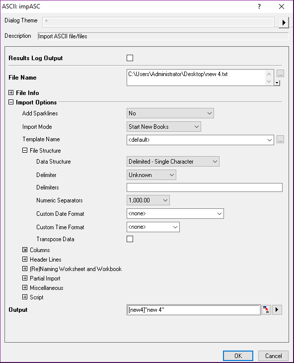

And the 0 always means that the value is determined by the Program:
> 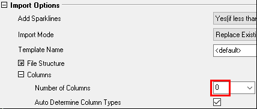

### ASCII file multi-import

When use the Multi-ASCII: **File/Import/Multi-Import** or 

会导入数据到不同的book中

## Import Database
> 

OriginLab支持的数据库太少，一般是将数据Export，然后Origin进行Import

## import Excel

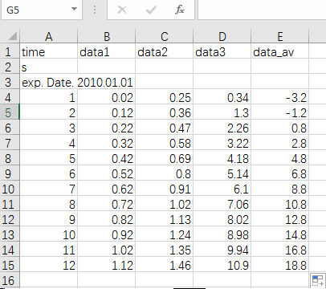

4 methods:
1. copy-paste
    > 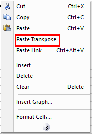
2. Drag
    
    If there is no Dialog, you should Tools/Options/Prompt Before
    > 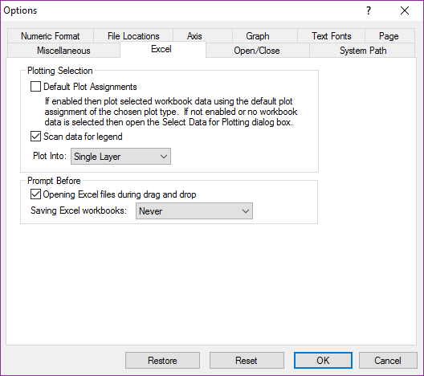
3. File/Import/Excel
4. File/Open Excel

    Internal只能通过Origin打开该Excel, External只是外部文件的链接;  
    File/New/Excel的默认为Internal, File/Open Excel打开的默认External;  
    如果保存为Internal的话，该Excel属于Project, 与原Excel无关; 保存为External，只是将改动更新到原Excel中
    > 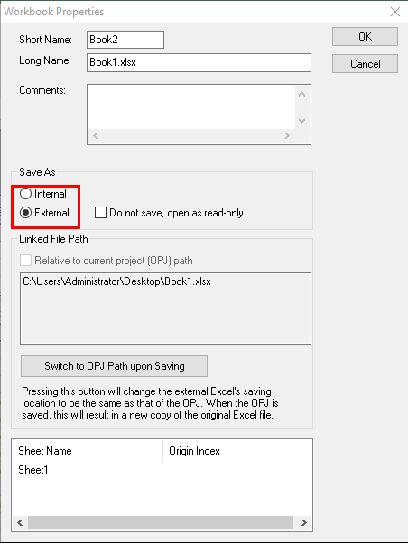

## Import Wizard

File/Import/Import Wizard, or 
> Import Wizard, Single ASCII, Multi-ASCII, Excel, Batch Processing

1. Source Window
    > 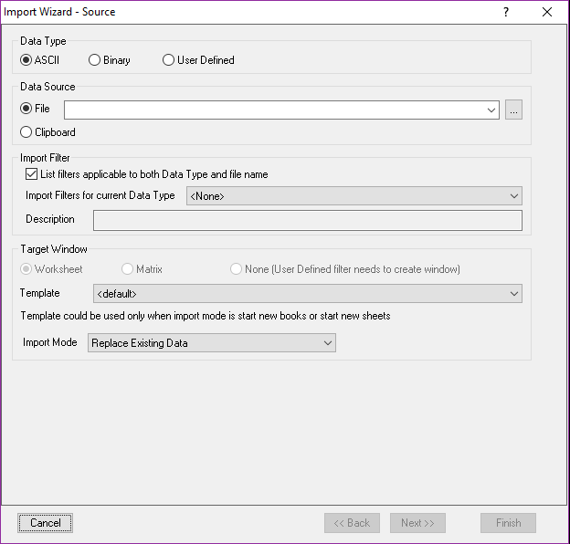  
    > The Clipboard only allow use the ASCII data
1. Headline window
    > 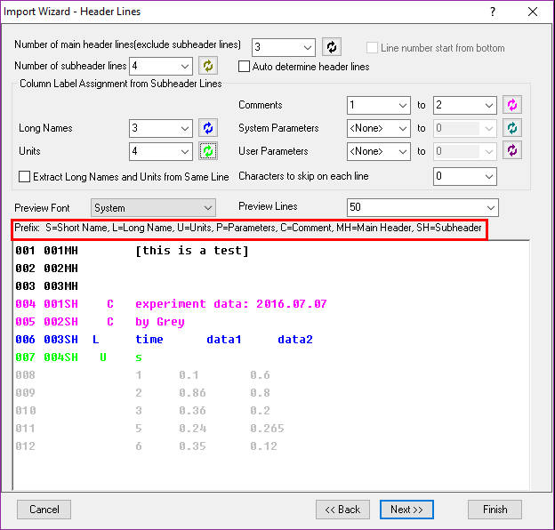  
    > 其中main header lines是不需要的，从排除了main header lines的行开始计数行数
1. Variable Extraction Window
    > 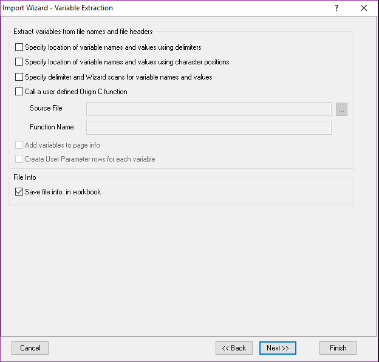  
    > 对于复杂的数据表或者若干个数据表组，提取表头信息作为变量，在编程的时候对图形和数据进行注解
1. Filename window
    > 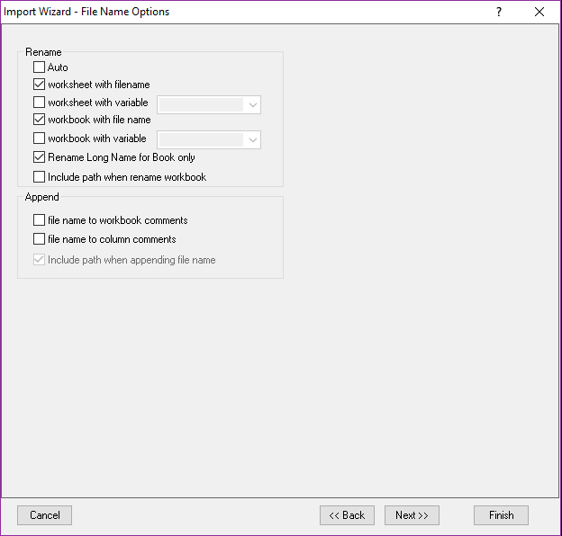
1. Data Columns
    > 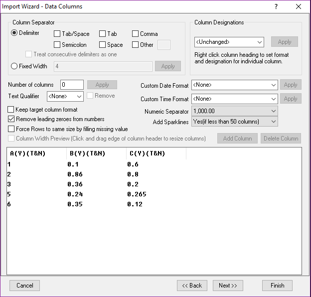  
    > Right click the A(Y),B(Y),C(Y), you can set format or designation  
    > 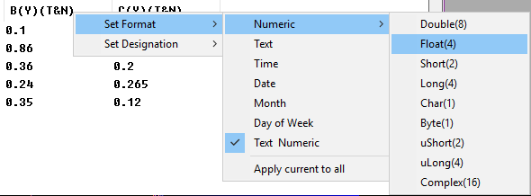
1. Data Selection
    > 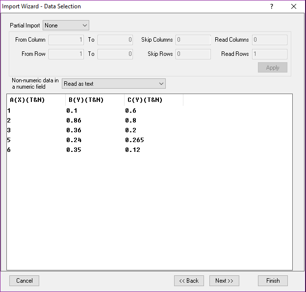
1. Save Filter to later used(let it be)
    > 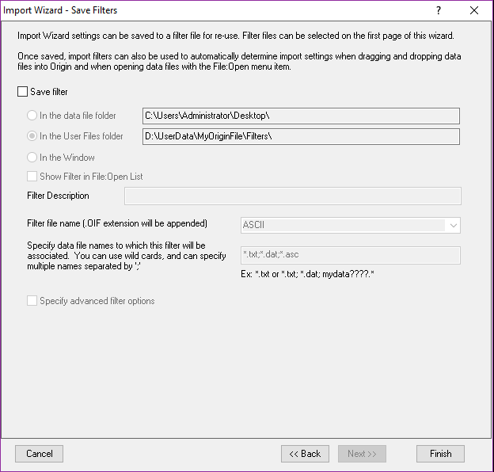  
    > When you check "Specify advanced filter options", there will be another window  
    > 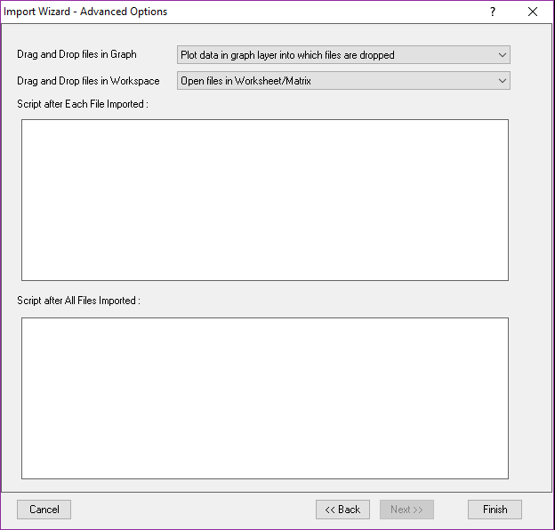  
    > 如果有多个Import Filter文件，拖拽文件的时候就会出现, Select Filter Dialog

如果把导入后的workbook另存为Template, 会包含所有的导入参数，以后相似的文件，可以直接拖拽，还可以直接拖拽到Graph中绘制Graph

## Import Binary

必须知道二进制的结构，其他都简单