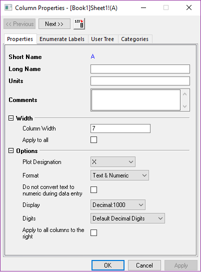
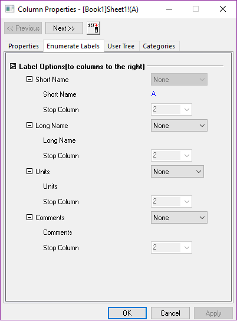
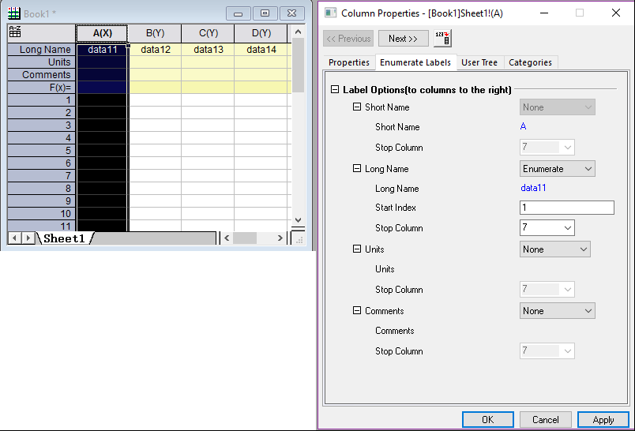
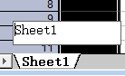
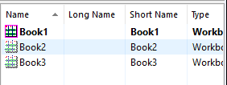
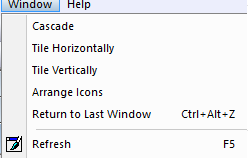
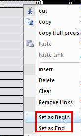
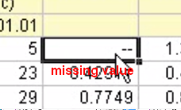
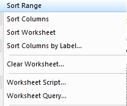
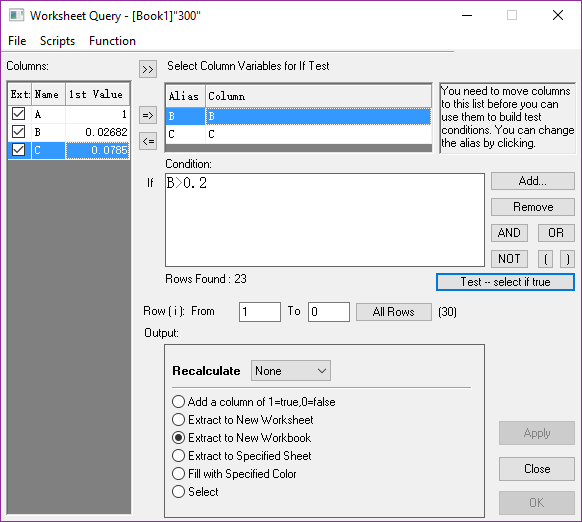

# Edit Workbook

- [Edit Workbook](#edit-workbook)

Double Click on the Short-Name, then

You can Enumerate the Column

User Tree:

保存与当前列有关的信息，导入文件时，会存储有关的信息

Double click to Rename the **Sheet**

Double Click to Hide or Reveal the items in the Project Explorer

And you can arrange the window

Hide the Above or Below data.

Restore: Select All, Edit/Reset to full Range

Swap Columns:
Select two columns, Columns/Swap Columns…

Sort worksheet:

- Select a region, worksheet/sort worksheet, and it will sort the first selection column
- And you can Custom, when it comes to same data, it will sort according to the order

Missing value:

Others:

Worksheet Query:

- Find in sheet: Edit/Find(Ctrl +F)
- Replace in sheet: Edit/Replace(Ctrl +H)
- Find and Replace in worksheet: using x-function