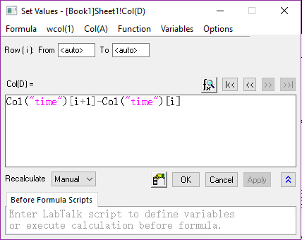
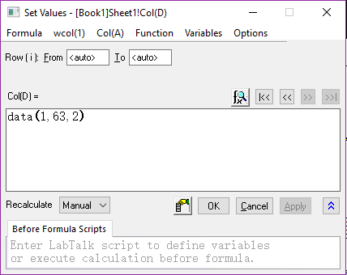
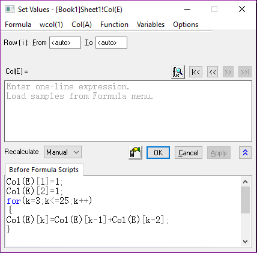
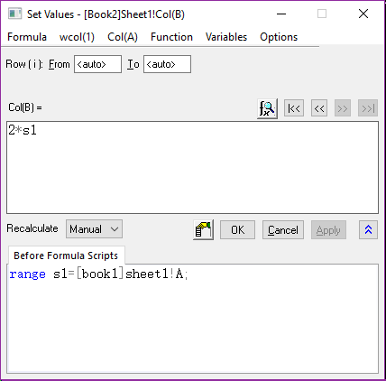

# Fill column with Function

- [Fill column with Function](#fill-column-with-function)

Column Set Values: **Ctrl +Q**

Wcol and Col is the same, just the name is different

Origin first calculate the Scripts, then calculate the **formula**



```bash
#自增
Col("time")[i+1]-Col("time")[i]
```



```bash
#奇偶列：
#1 to 63, increment=2
Data(1,63,2)
#or
{1:2:63}
```



```bash
#Fibonacci

Col(E)[1]=1;
Col(E)[2]=1;
for(k=3;k<=25;k++)
{
    Col(E)[k]=Col(E)[k-1]+Col(E)[k-2];
}
```

当要用的列在其他文件夹下面，就不能用Col, wcol就只能用Scripts



```bash
range=s1[book1]sheet1!A;
```