# 2D Plot

- [2D Plot](#2d-plot)
	- [Group to change color](#group-to-change-color)
	- [2D Plot feature and application](#2d-plot-feature-and-application)
	- [Excel Plot](#excel-plot)
	- [Function Plot](#function-plot)
	- [Summary](#summary)
	- [statistics plot](#statistics-plot)

 when in the workbook there many kinds of plot, while in the Matrix the kinds is less;

When want to plot the Y, it will auto find its X

When want to add a Y to existed Graph:

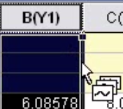

Wait to appear that symbol, then to drag

## Group to change color

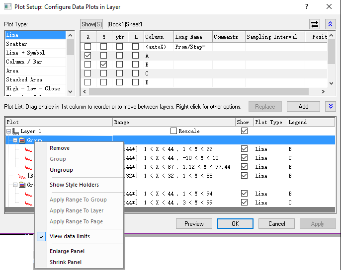

先取消所有Group, 然后再将它们弄到一个Group就可以实现颜色的区分了

具体的绘图：

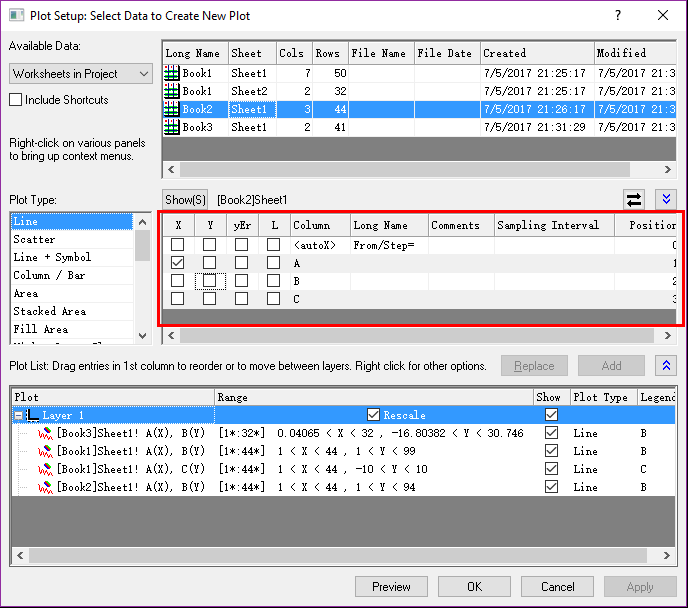

红色部分可以和workbook中的不一致，绘图的结果以这个为准，不影响workbook中的数据
不同的Plot Type, 不能放到同一个Group中

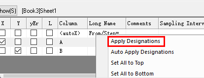

使用workbook指定的XY…

把Word中的Origin Graph生成数据：
双击word中的Graph,进行编辑，Create Workbook

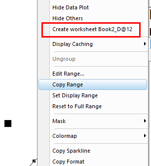

## 2D Plot feature and application

Line Series用于比较two colums的匹配度

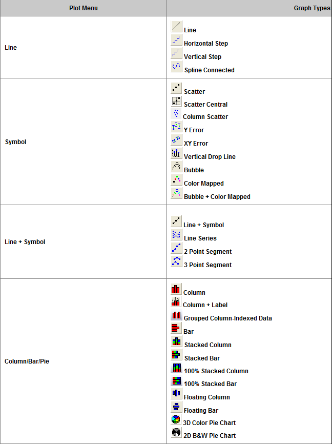

Double-Y 适合同一X，然而Y相差较大的情况

Multi-Y, Multi-Panel只是Layer的特殊应用而已

3D waterfall Y:Color Mapping这是沿着Y轴方向涂上了颜色

3D waterfall Z:Color Mapping这是沿着Zmu轴方向涂上了颜色

Trellis Plot not understand

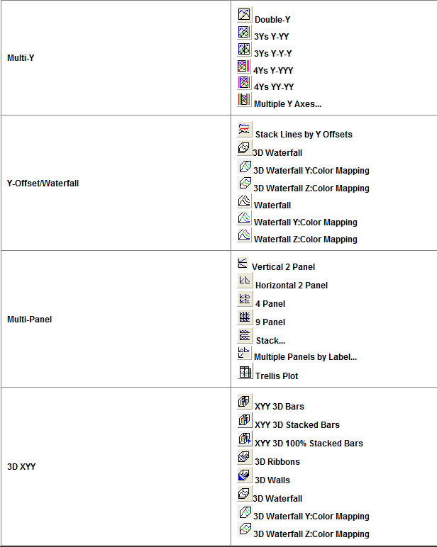

- Binned data: >=1column
- Raw data: =1column

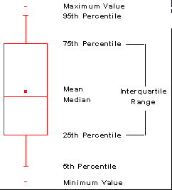

A popular convention is to make the box width proportional to the square root of the size of the group

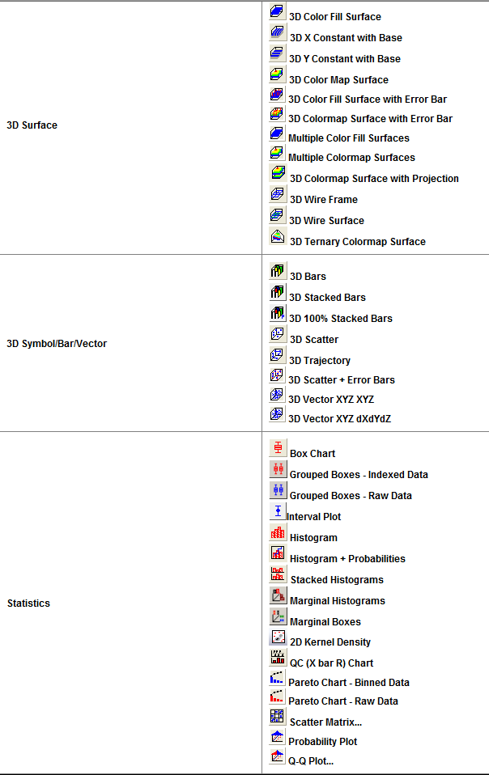

for Matrix, HeatMap is easy; for workbook, first it require that you convert the Data following the warning

Tenary will normalized the X,Y,Z(that is to say, x+y+z=1)

Piper not understand

Smith Chart用于微波射频电路中

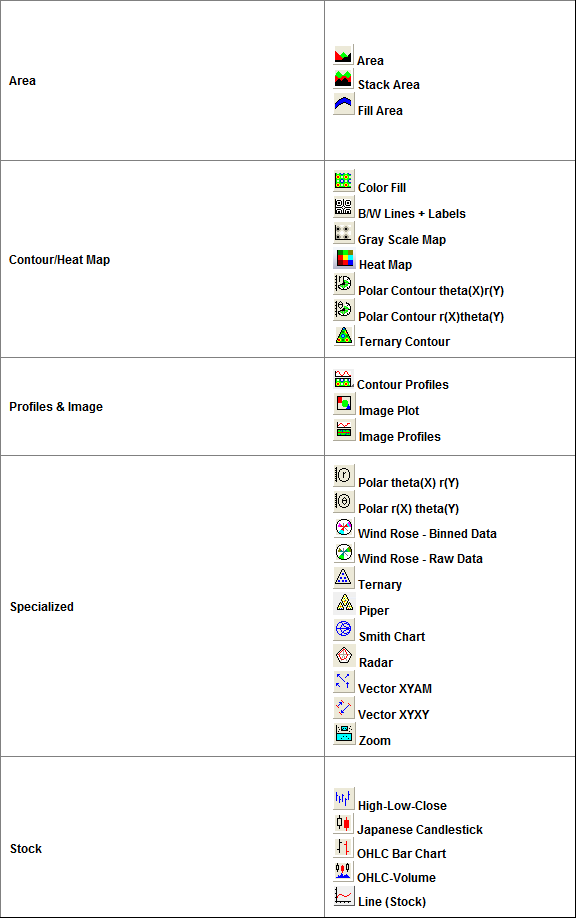

## Excel Plot

Excel中已经有数据

Plot/Line/,Select the column as X, Y, Z…, and if you want to set multi-Y, you should multi-select Y at the same time

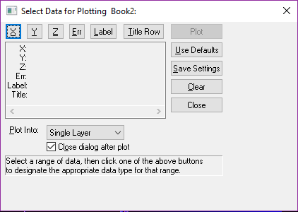

可以选择上图的一部分，点击Clear

## Function Plot

Ctrl +N, Function

要先是设置坐标系，然后再添加图层，否则切换坐标系之后，之前的设置都没了

## Summary

Plot/Multi-Panel适合于不同自变量的数据，但是放到同一个Graph中；

Plot/Multi-Panel/Stack适合相同自变量，不同y的情况；

wind Rose:根据某一地区多年平均统计的各个方向风向的频率分布；

Ternary:默认认为`X+Y+Z=1`,表示三种组分的百分数比例关系；如果没有归一化，会自动先进行归一化;

学会使用**Theme Organizer**, 还可以修改为**Set as System Theme**，默认用这个打开；

$$
\begin{cases}
	\text{内置主题}\\
	\text{系统主题}\\
	\text{用户自定义主题}
\end{cases}
$$

Plot/System Template中有大量的模板可以使用，结合Plot Setup,一般不需要自己去重新画layer

一般流程，先得到一个Graph1,然后得到一个Graph2，然后Graph/Merge Graph Windows/，得到的结果然后Tools/ThemeOrganizer/Physics Reveiw Letter/Apply

$$
\text{添加}layer\begin{cases}
	LayerManagement\\
	Graph/New\ Layer\\
	Graph/Merge\ Graph\ Windows\\
	Graph\ Toolbar
\end{cases}
$$

多图层合并legend:Graph/Lengend/Update/

- UpdateMode: Reconstruct
- legend: One legend for whole page

如果一个Graph中有多条曲线，使用GraphToolbar的ExtractToLayers可以分解到多个layer

也可以分解到多个Graph:Graph/Extract to Graphs

将一个Graph复制到另一个Graph中有两种方法：copy与copyPage

也可将workbook中的表格数据复制到Graph中，同步变化

可以通过对某一列的y进行整体的`+`, `-`来错开多个曲线；

可通过对某一列的x进行整体的`x`,`/`来拉伸曲线；

## statistics plot

如果用了plot/Statistics/Histogram之后，可以右击Graph/Go to Bin worksheet可以查看

- Bin center(区间段中心值)
- Counts
- Cumulative Sum
- Cumulative Probability

在PlotDetail对话框中的Data选项卡中的Type中修改**Type=Normal**可以添加正太曲线

