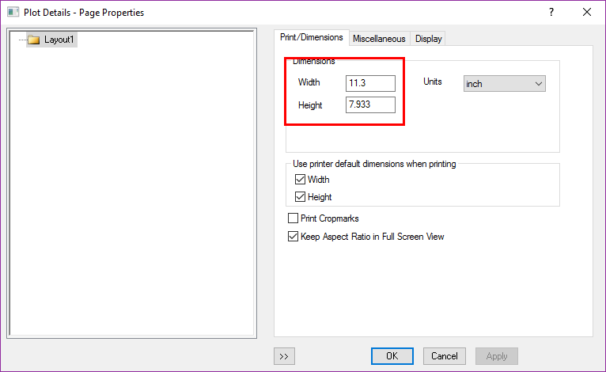
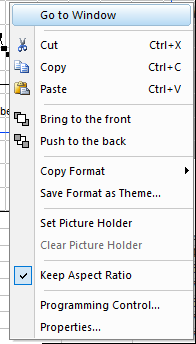
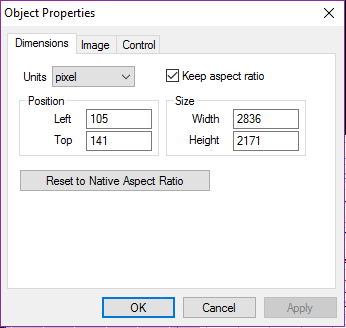
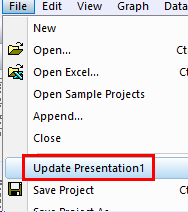

# Layout and Graph Export

Most important is the size
> 

Right Click, Go to Window: 回到源窗口
> 

Programming control, Properties:
> 

## Export

method1: OLE技术共享，OLE的最大缺陷是必须安装Origin,并且版本相同，才能编辑
- 复制粘贴: copy page
- 插入对象

Copy Page (**Ctrl +J**) to word, powerpoint, then double click in the word or powerpoint to edit the Graph, when finish the editing, File/Update Presentation
> 

method2: 导出为图片

Export Graph as picture: File/Export Graphs..

去除Graph边缘大空白:

- Ctrl +J method:Tools/Options/Page/Margin Control/Border/0
- Export as Picture:File/Export Graph/Export Setting/Margin Control/Border/0

