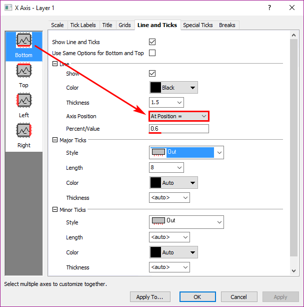
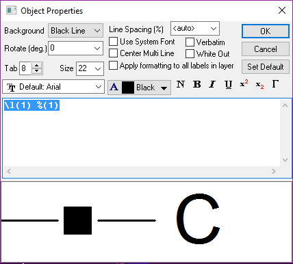

# Plot Details

<!-- TOC -->

- [Plot Details](#plot-details)
    - [Graph & layer](#graph--layer)
    - [Line & symbol](#line--symbol)
    - [Double click the curve to operate](#double-click-the-curve-to-operate)
    - [Plot Axis](#plot-axis)
    - [Plot Legend](#plot-legend)
    - [Theme to Draw Graph](#theme-to-draw-graph)
    - [Template to Draw Graph](#template-to-draw-graph)

<!-- /TOC -->

## Graph & layer

Double click the **out** blank area of the Graph, it will focus on the **Graph1**, and **Legend Update Mode** is important
> 
>   

Double click the **In** blank area of the Graph, 并且layers>1
> 

## Line & symbol

Double click the **line**
> 

- B-Spline：必须通过首尾的数据点
- Spline: 通过所有数据点
- Bezier: 每4个一组，通过第一个和第四个点

Nested vs concerted
> 

## Double click the curve to operate

Error bar plot detail
> 

Bubble -Color Map
> 

Columns
> 

Pie
> 

Stack Lines by Y offset:First, you should set the Layer stack
>   
> Then, go to the stacked line  
> 

Box
>   
> 

Contour
> 

Vector XYAM
> 

Vector XYXY
> 

单独修改某个点的Style:
Ctrl +Click the Point, to change the style of the point

## Plot Axis

- Double Click the Axis or the Tick Label
- Format/Axes, Format/Axis Tick Labels
>   
> 

Tips:

Right click on the Axis, These 4 function is very useful
> 

移动X轴的位置到Y轴0.6的位置
> 

Special Ticks
>   
> `%1`: 距离该位置最近的Major tick label  
> `$(x)`: 返回当前位置的坐标值  
> 还可以是字符串

## Plot Legend

Show legend Properties:
- Right Click on the legend, Properties
- Ctrl +Double click the legend
> 

`\`表示的是图中左边的object或者转义字符, `%`表示的是图中右边的变量, `@`表示的是一些常量
> [LegendManual](http://www.originlab.com/doc/Origin-Help/Legend-ManualControl)  
> [Escape-Sequence](https://www.originlab.com/doc/Origin-Help/Escape-Sequences)  
> [@ options](https://www.originlab.com/doc/LabTalk/ref/Text-Label-Options#Complete_List_of_.40Options)

- `\l(1) %(1)`: 第一个图层，第一条曲线； text采用Column的LongName
- `\l(1.2,5)`: 第一个图层，第二条曲线，第五个数据点
- `%(1.2,@r)`: 第一个图层，第二条曲线，的数据范围

Show Programming Control:
- Right click the legend;
- Alt +Double Click
> 

If check the **"No Selectable"**, you should **Edit/Button Edit Mode/**
>   
> Then, right click the legend to uncheck

Legend的update & reconstruct:
- update只是更新`%`部分的内容，reconstruct是更新`\`, `%`部分的内容
- When add or remove a curve, you should Graph/Update the Legend, to update the legend
- If delete the legend, you should Graph/New Legend to reconstruct the legend

> Graph的其他对象，比如Text也拥有Properties和Programming Tool对话框

## Theme to Draw Graph

Tools/Theme Organizer
> 

还可以在一个Graph中Right Click, Copy theme, 然后粘贴到另一个Graph中；还可以right click保存该主题；

## Template to Draw Graph

File/Save As Theme,

Select multi-Columns, Plot/User Templates/Template Library