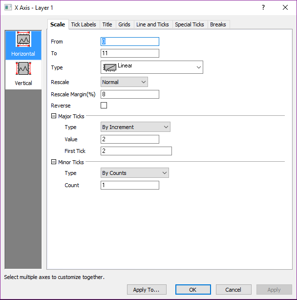
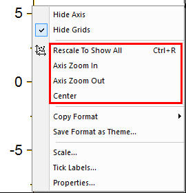

# Plot Axis

- [Plot Axis](#plot-axis)
    - [Axis Label](#axis-label)

Show the Setting:

- Double Click the Axis or the Tick Label
- Format/Axes, Format/Axis Tick Labels

Tips:

Right click on the Axis, These 4 function is very useful

## Axis Label

Symbol|meaning
---|---
%1|距离该位置最近的Major tick label
$(x)|返回当前位置的坐标值
