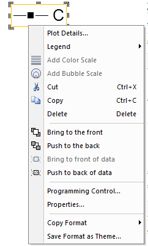
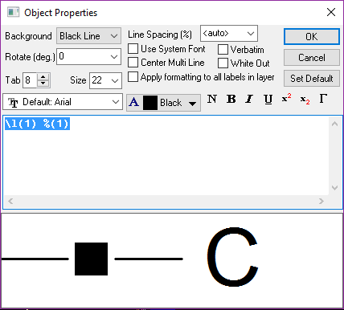
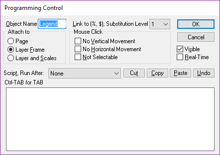
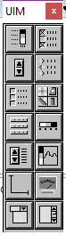

# Plot Legend

- [Plot Legend](#plot-legend)

[LegendManual](http://www.originlab.com/doc/Origin-Help/Legend-ManualControl)

Show legend Properties:

- Right Click on the legend, Properties
- Ctrl +Double click the legend

以`\`开始的为格式代码，以`%`开头的为指代代码，分别为**text formating**, **string register**

Search Origin Help: Available text formatting commands

||||
---|---|---
`\`|`\l(1.2,5)`|第一个图层，第二条曲线，第五个数据点
`%`|`%(1.2,@r)`|第一个图层，第二条曲线，的数据范围

常用:

|||
---|---
`\l`|Layer
`\=(1,2)`|Upper script, lower script

Show Programming Control:

- Right click the legend;
- Alt +Double Click

If check the **"No Selectable"**, you should **Edit/Button Edit Mode/**

Then, right click the legend to uncheck

When add or remove a curve, you should Graph/Update the Legend, to update the legend

If delete the legend, you should Graph/New Legend(Ctrl +L) to reconstruct the legend

除了legend有Properties, Programming Tool，其他Graph中的文本一般也有