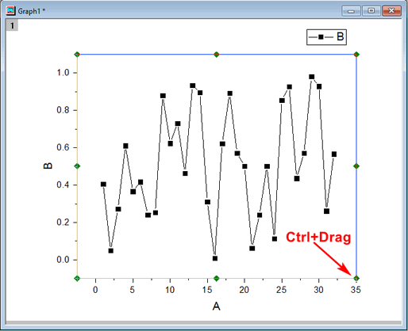
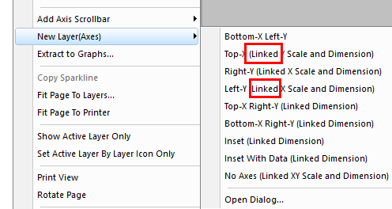
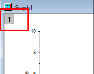
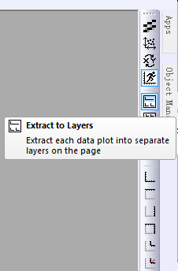
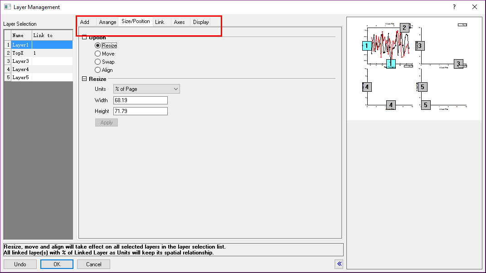

# Multi-Layers

<!-- TOC -->

- [Multi-Layers](#multi-layers)
    - [How to Draw Graph](#how-to-draw-graph)
        - [Method1](#method1)
        - [Method2](#method2)
        - [Method3](#method3)
        - [Method4](#method4)
    - [Other Operation](#other-operation)
    - [Layer Management](#layer-management)

<!-- /TOC -->

<kbd>Ctrl</kbd> + Drag: 按比例缩放Graph
> 

Linked: 新Layer与当前的坐标轴部分是相同的
> 

精确调整Graph位置: View/Show/Layer Grid, Format/Snap Graph to Grid, then move the Graph
> 其中Grid size可以在Tools/Options/Page/Grid spacing….中设置  
> 如果Graph跑到了outer， 那么右键Fit Page to Layers

## How to Draw Graph

### Method1

<kbd>Ctrl</kbd>+<kbd>N</kbd>, to new Graph;

Right Click the "red" to open the Layer Content
> 

Or Right Click the "red" to open the Plot Setup;
> 

### Method2

Choose multi-columns and drag to Graph window

### Method3

Select multi-columns, Select a layer, Graph/Add Plot to layer

### Method4

Copy-Paste the Graph

## Other Operation

把多个图形分解到多个图层: Extract to Layers
> 

把多个图形分解到多个窗口: Extract to Graph

多窗口合并成多个图层: Merge

## Layer Management

