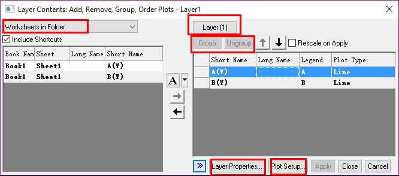

# Multi-Layers

- [Multi-Layers](#multi-layers)
    - [How to Draw Graph](#how-to-draw-graph)
        - [Method1](#method1)
        - [Method2](#method2)
        - [Method3](#method3)
        - [Method4](#method4)
    - [把多个图形分解到多个图层](#%E6%8A%8A%E5%A4%9A%E4%B8%AA%E5%9B%BE%E5%BD%A2%E5%88%86%E8%A7%A3%E5%88%B0%E5%A4%9A%E4%B8%AA%E5%9B%BE%E5%B1%82)
    - [Layer Management](#layer-management)

Linked: means that the layer will link the current one

Ctrl +Drag: keep ratio to zoom in or out Graph

View/Show/Layer Grid, Format/Snap Graph to Grid, then move the Graph

You can change the Grid size by Tools/Options/Page/Grid spacing….

If a layer is too big, Right Click the Outer, Fit Layers to Page

## How to Draw Graph

### Method1

Ctrl +N, to new Graph;

Double Click the "red" to open the Layer Content

Or Alt +Double Click the "Red" to open the Plot Setup;

### Method2

Choose multi-columns and drag to Graph window

### Method3

Select multi-columns, Select a layer, Graph/Add Plot to layer

### Method4

Copy-Paste the Graph

## 把多个图形分解到多个图层

Extract to Graph(分解成多个窗口)

Merge(多窗口合并成多个图层)

## Layer Management

