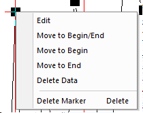

# Toolbars

<!-- TOC -->

- [Toolbars](#toolbars)
    - [Tools](#tools)
    - [Some other tools](#some-other-tools)
    - [Graph Tools](#graph-tools)
    - [Mask Tools](#mask-tools)
    - [Object Edit Tools](#object-edit-tools)

<!-- /TOC -->

Toolbars:

- Tools
- Graph
- Mask
- Object Edit

## Tools

- **Pointer**;
- **Zoom in**;
- **Zoom out**;
- **Screen Reader**(current layer);
- **Data Reader**(only read data point), **Data annotation**, **Data cursor;**
- **Data Selector**;
    > When finish the select, you can right click to edit the Selector  
    > 
- **Selection on Active Plot**, **Selection on All Plot**;
- **Mask on Active Plot, Mask on All Plot, Unmask on Active Plot, Unmask on All Plot**;
- **Draw Data**(double click to draw a data, Esc to finish the operation);
- Text Tool;
- Arrow Tool, Curve Arrow Tool;
- Line Tool, Polyline Tool(double click to finish), Freehand Draw Tool;
- Rectangle Tool, Circle Tool(Ctrl +Draw the circle), Polygon Tool, Region Tool;
    > All these shapes contain "Programming Control" and "Properties"
- Pan Tool(Hold A to move, wheel to Zoom);
- Insert Equation(not work), Insert Word(don't use), Insert Excel(don't use), Insert Object(was powerful for MathType)
- Insert Graph, Insert Worksheet;
- **Rescale Tool**
  - Z,X for X-Axis;
  - Shift +Z,X for Y-Axis;
  - Also can use wheel or up, down, left, right
- **Rotate Tool**
  - When it is 3D, Hold R, Drag to rotate the image

## Some other tools

- New Color Scale(for 3D);
- New Bubble(for high dimension);
- New Legend;
- Add asterisk;
- New XY Scaler(比例尺);
- Add Date time;
- Project Path(stamp the graph with project's path, only when you save your project);
- New Table;

## Graph Tools

- Anti-Aliasing;
- Rescale(Ctrl +R);
- Exchange X,Y;
- Speed Mode;;
- Extract to layers;
- Extract to Graphs;
- Merge;
- Duplicate with new book(just replace the data);;
- Then comes the 6 Add layers;

## Mask Tools

- Mask Range(first you should select you data In workbook);
- Unmask Range;
- Change Mask Color;
- Hide/Show Mask(only use in the Graph);
    > 当断线的时候，Plot Details/Graph1/Display, 将断线连接  
    > 
- Swap Mask;
- Enable/Disable mask;

## Object Edit Tools

- The first 6 is easy;
- Uniform width;
- Uniform height;
- Front object;
- Back object;
- Front Data;
- Back Data;
- Group;
- Ungroup;