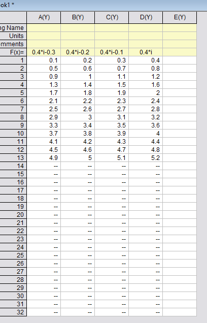

# Origin Matrix

- [Origin Matrix](#origin-matrix)
    - [New Matrix](#new-matrix)
    - [Convert Between Matrix & workbook](#convert-between-matrix-workbook)
        - [Workbook to matrix](#workbook-to-matrix)
        - [matrix to workbook](#matrix-to-workbook)

## New Matrix

Show the X,Y of the Matrix:

- View/Show X,Y(Ctrl +Shift +X)
- If want to return to Show Columns, Rows(Ctrl +Shift +C)

Very useful:

- Expand: using interpolation method, Bi-Linear
- Shrink: using interpolation method, average

Insert or Add Matrix

矩阵和二维的Column是同等地位的

## Convert Between Matrix & workbook

### Workbook to matrix

Select workbook, Worksheet/Convert to Matrix/

- Direct:Too easy
- Expand:

失败的例子:Factor=2, orientation=row,原来的两行变成1行，原始的两行数据必须是满的

失败的例子:Factor=2, orientation=column,原来的两列变成1列，原始的两列数据必须是满的

### matrix to workbook

