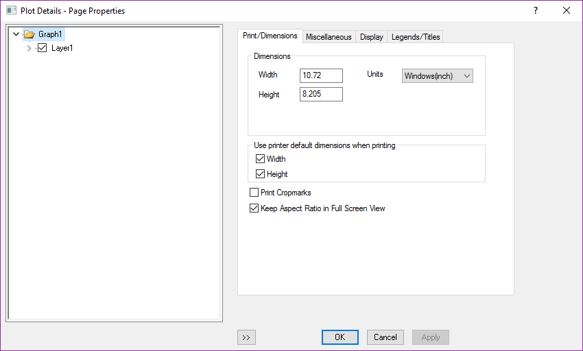

# 3D plot

- [3D plot](#3d-plot)
    - [3D plot Detail](#3d-plot-detail)

```bash
#A Peak function
3*(1-x)^2*exp(-(x^2) - (y+1)^2) - 10*(x/5 - x^3 - y^5)*exp(-x^2-y^2) - 1/3*exp(-(x+1)^2 - y^2)
```

To make X,Y Aspect ratio equal


To change the tick of the plot, or double click the axis


- 前6个，6个方向的旋转；
- Increase perspective;
- Decrease perspective;
- Fit frame to layer;
- Reset Rotation;
- Reset;

## 3D plot Detail

Plot Detail for Graph1 is the same as 2D-Plot



Plot Details for layer1, new of the 3D plot


Miscellaneous: Clipping

Plot Details for Msheet(不同种类的图对应不同的设置，仅仅以这个3D surface为例)

New for 3D Plot


