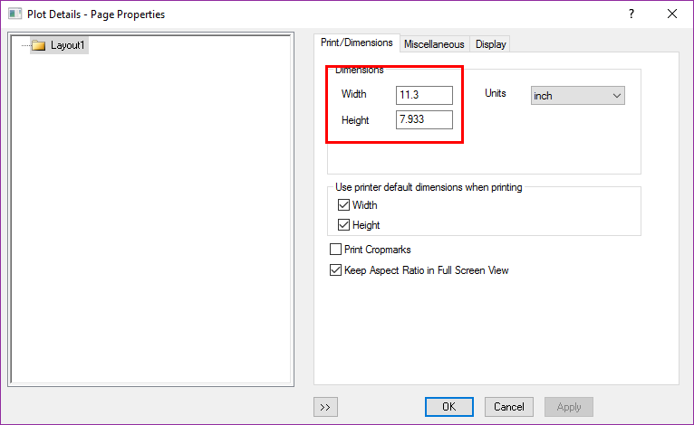
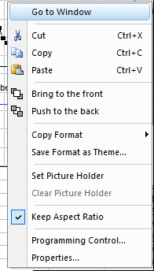
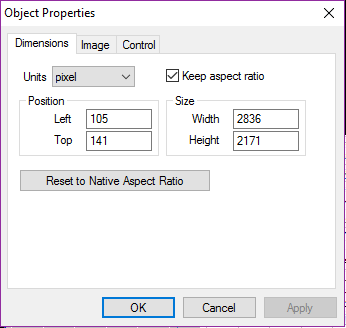
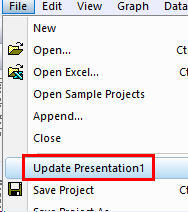

# Layout and Graph Export

- [Layout and Graph Export](#layout-and-graph-export)
    - [Export](#export)

Most important is the size

Right Click, Go to Window:

Programming control, Properties:

## Export

method1: OLE技术共享

- 复制粘贴
- 插入对象

method2: 导出为图片

Copy Page (**Ctrl +J**) to word, powerpoint, then double click in the word or powerpoint to edit the Graph, when finish the editing, File/Update Presentation

Export Graph as picture: File/Export Graphs..(**Ctrl +G**)

去除Graph边缘大空白:

- Ctrl +J method:Tools/Options/Page/Margin Control/Border/0
- Export as Picture:File/Export Graph/Export Setting/Margin Control/Border/0

OLE的最大缺陷是必须安装Origin,并且版本相同，才能编辑

