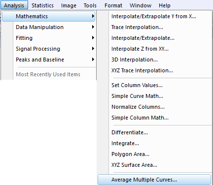
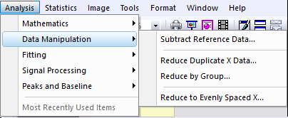
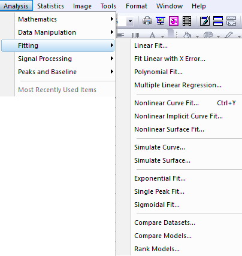
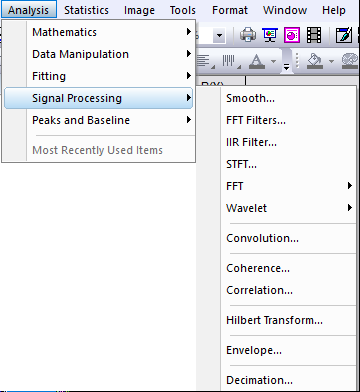
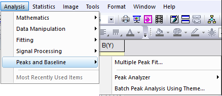
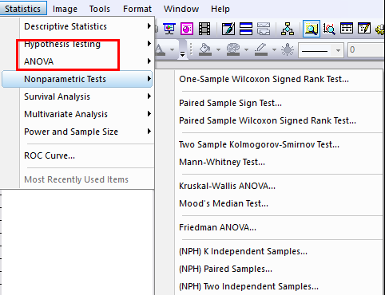

# Data Analysis Introduction

- [Data Analysis Introduction](#data-analysis-introduction)
    - [Analysis](#analysis)
        - [Mathematics](#mathematics)
        - [Data Manipulation](#data-manipulation)
        - [Fitting](#fitting)
        - [Signal processing](#signal-processing)
        - [Peaks & Baseline: 谱峰和基线识别](#peaks-baseline-%E8%B0%B1%E5%B3%B0%E5%92%8C%E5%9F%BA%E7%BA%BF%E8%AF%86%E5%88%AB)
    - [Statistics](#statistics)
    - [Image](#image)

数据分析功能都在工具栏的 Analysis, Statistics, Image中

## Analysis

### Mathematics

插值，算术运算，微积分，多曲线平均

### Data Manipulation

Subtract reference data: 用于数据校正

### Fitting

### Signal processing

### Peaks & Baseline: 谱峰和基线识别

## Statistics

Hypothesis testing and ANOVA is very important

Nonparametric Test：总体分布未知的统计检验

Survival Analysis: 时间相关的数据演化

Power and Sample Size:可以同时控制假设检验的A错误和B错误，综合评价假设检验和方差分析的结果

ROC curve: 用于二值判别效果的评价分析

## Image

pass

Workbook, Graph, matrix中的Analysis, statistics, Image不太一样，只提供workbook的演示