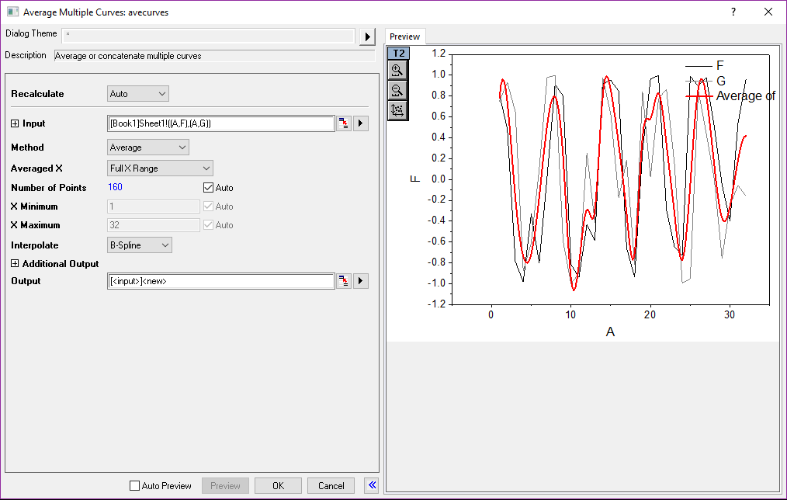

# Mathematics

<!-- TOC -->

- [Mathematics](#mathematics)
    - [Interpolation](#interpolation)
        - [Analysis/Mathematics/Interpolate-Extrapolate Y from X](#analysismathematicsinterpolate-extrapolate-y-from-x)
        - [Analysis/Mathematics/Trace Interpolation](#analysismathematicstrace-interpolation)
        - [Analysis/Mathematics/Interpolate-Extrapolation](#analysismathematicsinterpolate-extrapolation)
        - [Analysis/Mathematics/Interpolate Z from XY](#analysismathematicsinterpolate-z-from-xy)
        - [Analysis/Mathematics/3D Interpolation](#analysismathematics3d-interpolation)
        - [Analysis/Mathematics/XYZ Trace Interpolation](#analysismathematicsxyz-trace-interpolation)
    - [Others 01](#others-01)
        - [Set Column Values: too easy](#set-column-values-too-easy)
        - [Simple Curve math](#simple-curve-math)
        - [Normalize Columns](#normalize-columns)
        - [Simple Column Math](#simple-column-math)
    - [Others 02](#others-02)
        - [Differentiate](#differentiate)
        - [Integrate](#integrate)
        - [Polygon Area](#polygon-area)
        - [XYZ surface Area](#xyz-surface-area)
        - [Average Multiple Curve](#average-multiple-curve)

<!-- /TOC -->

## Interpolation

- 利用新数据点左右两侧的数据点：内插(Interpolate)
- 利用新数据点一侧的数据点：外插(extrapolate)
> 

### Analysis/Mathematics/Interpolate-Extrapolate Y from X

- Linear: easy
- Cubic Spline: …
- Cubic B-Spline: Bessel, Smooth Factor: 数值越大，越平滑，但是越偏离实际情况
- Akima Spline:

### Analysis/Mathematics/Trace Interpolation

在**原有范围**基础上直接均匀插入点
> 

### Analysis/Mathematics/Interpolate-Extrapolation

**自定义范围**，均匀插入点
> 

### Analysis/Mathematics/Interpolate Z from XY

### Analysis/Mathematics/3D Interpolation

4维数据
> 

### Analysis/Mathematics/XYZ Trace Interpolation

So far Interpolation is finished

## Others 01

### Set Column Values: too easy

<kbd>Ctrl</kbd>+<kbd>Q</kbd>

### Simple Curve math

**Use Common Range** mean interpolation or extrapolation
> 

### Normalize Columns

### Simple Column Math

## Others 02

### Differentiate

$$
f'\left( x_i \right) =\frac{1}{2}\left( \frac{y_{i+1}-y_i}{x_{i+1}-x_i}+\frac{y_i-y_{i-1}}{x_i-x_{i-1}} \right)
$$

### Integrate

Baseline is very important: 红色表示将首尾点连线作为baseline
> 

$$
\int_{x_1}^{x_n}{f\left( x \right) dx}=\sum_{i=1}^{n-1}{\left( x_{i+1}-x_i \right)}\frac{f\left( x_{i+1} \right) +f\left( x_i \right)}{2}
$$

### Polygon Area

### XYZ surface Area

### Average Multiple Curve

So far, Mathematics is finished

