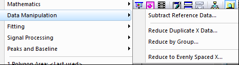
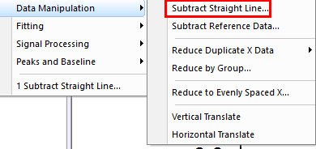
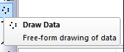
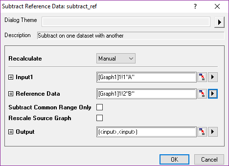
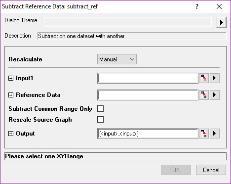
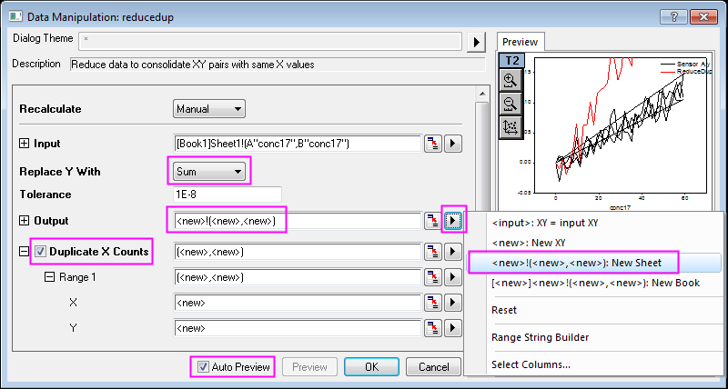
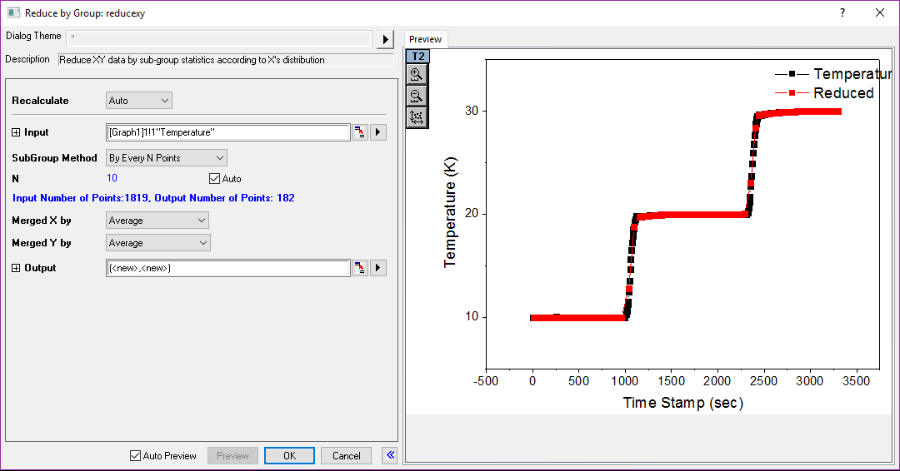
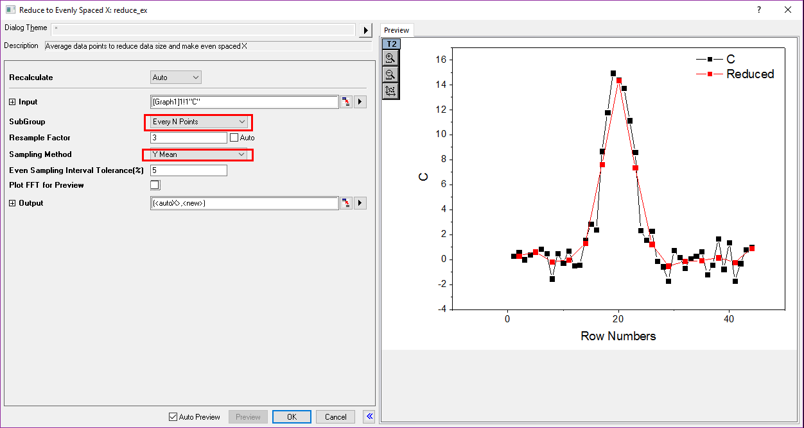

# Data Manipulation

- [Data Manipulation](#data-manipulation)
    - [Baseline](#baseline)
    - [Subtract Straight Line](#subtract-straight-line)
    - [Subtract Referenced Data](#subtract-referenced-data)
    - [Reduce Duplicate X Data](#reduce-duplicate-x-data)
    - [Reduce by Group](#reduce-by-group)
    - [Reduce to Evenly spaced X](#reduce-to-evenly-spaced-x)
    - [Horizontal, Vertical Translate](#horizontal-vertical-translate)

## Baseline

baseline经常用于光谱的谱图, 数据会覆盖原始数据,建议备份后使用

通常在Graph中使用这个，会有增加的选项; 在workbook中，Subtract Referenced Data和simple math没什么差别

## Subtract Straight Line

Double click two point to subtract the baseline,
通常配合这个使用

其中B是用Draw Data画出来的

## Subtract Referenced Data

## Reduce Duplicate X Data

Reduce Duplicate X Data

FFT=Fast Fourier Transform

## Reduce by Group

## Reduce to Evenly spaced X

## Horizontal, Vertical Translate

水平或者垂直移动baseline(baseline位于数据点上)