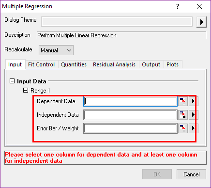
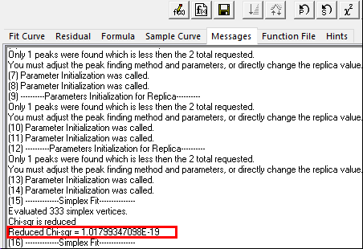
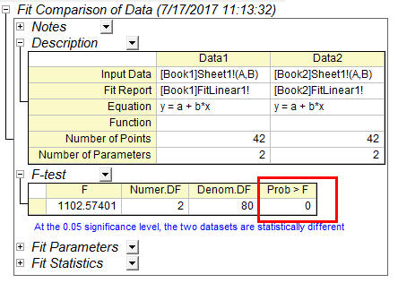

# Fitting

<!-- TOC -->

- [Fitting](#fitting)
    - [Fitting/Linear Fit](#fittinglinear-fit)
    - [Fitting/Polynominal](#fittingpolynominal)
    - [Fitting/Multiple Regression](#fittingmultiple-regression)
    - [Fitting/Fit Linear with X error](#fittingfit-linear-with-x-error)
    - [Append Fitting Report Table](#append-fitting-report-table)
        - [Fit linear worksheet](#fit-linear-worksheet)
        - [Notes](#notes)
        - [Input Data](#input-data)
        - [Masked data](#masked-data)
        - [Bad data](#bad-data)
        - [Parameters](#parameters)
        - [Statistics](#statistics)
        - [Summary](#summary)
        - [ANOVA: Analysis of variance](#anova-analysis-of-variance)
        - [Fitted Curve plot](#fitted-curve-plot)
        - [Residual Plot](#residual-plot)
        - [Others](#others)
        - [FitLinearCurve1 worksheet](#fitlinearcurve1-worksheet)
    - [Fitting/Nonlinear](#fittingnonlinear)
        - [Fitting/Nonlinear Curve fit](#fittingnonlinear-curve-fit)
            - [Code Tab](#code-tab)
            - [Parameter Tab](#parameter-tab)
            - [Bound Tab](#bound-tab)
        - [Fitting/Nonlinear Implicit Curve Fit](#fittingnonlinear-implicit-curve-fit)
        - [Fitting/Nonlinear surface fit](#fittingnonlinear-surface-fit)
        - [Fitting/Simulate Curve](#fittingsimulate-curve)
        - [Fitting/Simulate Surface](#fittingsimulate-surface)
    - [Fitting-User defined](#fitting-user-defined)
    - [Other Fitting](#other-fitting)
        - [Fitting/Single Peak fit: 只是Nonlinear curve fit的特殊情况](#fittingsingle-peak-fit-只是nonlinear-curve-fit的特殊情况)
        - [Fitting/Exponential Fit](#fittingexponential-fit)
        - [Fitting/Sigmoidal](#fittingsigmoidal)
        - [Fitting/Compare Datasets](#fittingcompare-datasets)
            - [Example 01](#example-01)
        - [Fitting/Compare Models](#fittingcompare-models)
            - [Example 02](#example-02)
        - [Fitting/Rank Models](#fittingrank-models)
    - [拟合结果](#拟合结果)
        - [残差分析](#残差分析)
            - [Residual vs independent](#residual-vs-independent)
            - [Residual vs order of data](#residual-vs-order-of-data)

<!-- /TOC -->

最小二乘法(less-square method)

$$
\begin{aligned}

&\left( x_i,y_i \right) \text{i=1, 2, 3, ..., n}
\\
&y=f\left( x;\vec{\beta} \right)
\\
&\text{确定}\vec{\beta}=\vec{\beta}^*,\text{使}\sum_{i=1}^n{w\left( x_i \right) \left[ y_i-f\left( x_i;\vec{\beta}^* \right) \right] ^2=\underset{\vec{\beta}}{\min}\sum_{i=1}^n{w\left( x_i \right) \left[ y_i-f\left( x_i;\vec{\beta}^* \right) \right] ^2}}
\\
&\frac{\partial}{\partial \vec{\beta}}\left. \sum_{i=1}^n{w\left( x_i \right) \left[ y_i-f\left( x_i;\vec{\beta} \right) \right] ^2} \right|_{\vec{\beta}=\vec{\beta}^*}=0 \text{得到}\vec{\beta}^*
\\
&\text{拟合方程:\ }y=f\left( x;\vec{\beta}^* \right)

\end{aligned}
$$

线性拟合

$$
\begin{aligned}
&y=f(x;\vec{\beta})=\beta_0+x\beta_1
\\\\
&\beta_0=\frac{n\sum_{i=1}^n{x_iy_i}-\sum_{i=1}^n{x_i}\sum_{i=1}^n{y_i}}{n\sum_{i=1}^n{x_i^2}-(\sum_{i=1}^n{x_i})^2}
\\\\
&\beta_1=\frac{\sum_{i=1}^n{x_i^2}\sum_{i=1}^n{y_i}-\sum_{i=1}^n{x_iy_i}\sum_{i=1}^n{x_i}}{n\sum_{i=1}^n{x_i^2}-(\sum_{i=1}^n{x_i})^2}

\end{aligned}
$$

二次函数

$$
\begin{aligned}
&y=f(x;\vec{\beta})=\beta_0+x\beta_1+x^2\beta_2
\\\\
&\beta_0=\frac{\sum{y_i}[(\sum{x_i^3})^2-\sum{x_i^2}\sum{x_i^4}]+\sum{x_iy_i}(\sum{x_i}\sum{x_i^4}-\sum{x_i^2}\sum{x_i^3})+\sum{x_i^2y_i}[(\sum{x_i^2})^2-\sum{x_i}\sum{x_i^3}]}{(\sum{x_i^2})^3+(\sum{x_i})^2\sum{x_i^4}-2\sum{x_i}\sum{x_i^2}\sum{x_i}^3+n(\sum{x_i^3})^2-n\sum{x_i^2}\sum{x_i^4}}
\\\\
&\beta_1=\frac{\sum{y_i}(\sum{x_i}\sum{x_i^4}-\sum{x_i^2}\sum{x_i^3})+[(\sum{x_i^2})^2-n\sum{x_i^4}]\sum{x_iy_i}+(n\sum{x_i^3}-\sum{x_i}\sum{x_i^2})\sum{x_i^2y_i}}{(\sum{x_i^2})^3+(\sum{x_i})^2\sum{x_i^4}-2\sum{x_i}\sum{x_i^2}\sum{x_i}^3+n(\sum{x_i^3})^2-n\sum{x_i^2}\sum{x_i^4}}
\\\\
&\beta_2=\frac{\sum{y_i}[(\sum{x_i^2})^2-\sum{x_i}\sum{x_i^3}]+\sum{x_iy_i}(n\sum{x_i^3}-\sum{x_i}\sum{x_i^2})+[(\sum{x_i})^2-n\sum{x_i^2}]\sum{x_i^2y_i}}{(\sum{x_i^2})^3+(\sum{x_i})^2\sum{x_i^4}-2\sum{x_i}\sum{x_i^2}\sum{x_i}^3+n(\sum{x_i^3})^2-n\sum{x_i^2}\sum{x_i^4}}

\end{aligned}
$$

## Fitting/Linear Fit

> ANOVA: analysis of Variance

## Fitting/Polynominal

相较于Linear Fit, 仅仅多了

## Fitting/Multiple Regression

$$
y=\beta_0+x_1\beta_1+x_2\beta_2+x_3\beta_3+...x_n\beta_n
$$

相较于Linear Fit, 仅仅多了

## Fitting/Fit Linear with X error

其他的差不多

## Append Fitting Report Table

### Fit linear worksheet

### Notes

### Input Data

### Masked data

### Bad data

### Parameters

### Statistics

### Summary

### ANOVA: Analysis of variance

### Fitted Curve plot

### Residual Plot

### Others

- Covariance
- Correlation
- Residual vs Independent Plot
- Histogram of the Residual Plot
- Residual vs Predicted Valued Plot
- Residual vs the Order of the Data Plot
- Residual Laq Plot

### FitLinearCurve1 worksheet

The right one means: the data of this column cannot be edited

- FitlinearFindXfromY1 worksheet: 根据Scripts实现的, 输入X的值，根据拟合方程得到Y的值
- fitlinearFintYfromX1 worksheet:根据Scripts实现的, 输入Y的值，根据拟合方程得到X的值

## Fitting/Nonlinear

### Fitting/Nonlinear Curve fit

|||
---|---
Convolution|卷积
Sigmoidal|S 型
Hyperbola|双曲线
Logarithm|对数
Piecewise|分段
Chromatography|色谱
Electrophysiology|电生理
Enzyme|酶
Pharmacology|药理学
Rheology|流变学

Replica and Fit Control is important, and others are the same as mentioned
> 多个峰的时候采用replica来指定是多少个Gauss峰  
> fit control中的Iteration表示要么达到tolerance, 要么达到次数，fitting就会终止

自定义拟合才使用Derivative Delta:计算函数在各个参数上的偏导数，是最小二乘求极值的步骤，采用的是差分法

#### Code Tab

- Parameter Init: Parameter initialize
- Enable Linear Constraint:
    > 

#### Parameter Tab

- 输入初始值value，可能提高迭代效率，迭代来源于非线性近似为线性的过程中，引入1阶偏导，所以差分形式出现了前后参数的差别，进而形成联系，可以进行迭代
- 可能出现"Fit didn't converge"不收敛

#### Bound Tab

指定各个参数的范围
>   
> 

Simplex: 给参数赋予大体趋势与原始数据相似的值，效果等同于在parameters tab手动调节初始值

Chi square: 残差平方和，结果在Message Tab中显示
> 

这7个都是非常容易理解的

### Fitting/Nonlinear Implicit Curve Fit

### Fitting/Nonlinear surface fit

- 和之前的操作类似，有Gauss 2D函数
- Matrix中还有一个Nonlinear Matrix Fit, 也有Gauss 2D

### Fitting/Simulate Curve

通过函数产生数据

### Fitting/Simulate Surface

同理

## Fitting-User defined

Tools/Fitting Function Organizer
> 

FunctionType: 建议User-defined
> 

FunctionForm: 建议OriginC
> 

- Y-Script: 可以向下兼容，速度慢
- Expression: 只有一个因变量
- Equations: >=1因变量
- Origin C: most common

> 写完函数，点击Compile, return to dialog

点击，赋初值，确定上下限
> 

初始化值，然后Compile
> 

由拟合参数定义这些导出参数，这些参数不参与拟合，通过拟合后的参数进行计算得到

- The  Builder will open Tools/Fitting Function Builder;
- Duplicate will duplicate the function;
- Add: you can add others' function to you category
- Simulate: is the same as mentioned above

## Other Fitting

### Fitting/Single Peak fit: 只是Nonlinear curve fit的特殊情况

### Fitting/Exponential Fit

### Fitting/Sigmoidal

### Fitting/Compare Datasets

两组数据，同一个Model，是否显著差异; 比对的是拟合后的report table

#### Example 01

1.先将两个workbook中的数据用相同方法(linear, nonlinear)拟合，拟合Dialog中需要勾选下面三项，用于比较datasets

2.Fitting/Compare Datasets:

得到:其中最有用的是Prob>F, =0表示0%概率保证两组数据有差异，也就是100%概率表示它们适合当前的拟合函数

### Fitting/Compare Models

同一组数据，两种拟合Model，是否存在显著差异;比对的是拟合后的report table

#### Example 02

1.First use two model to fit, for example **Gauss** and **Lorentz**, get two Result report;

2.Fitting/Compare Models;

AIC, BIC用于检验那个拟合更好，F-Test表示二者之间有没有显著差异

- 该检验，F-Test失效；
- 其中underline反映了Model1效果更好
- Focus on the "AIC" and "Akaike Weithgt", or "BIC" and "Diff BIC"
- The smaller AIC, the better the model

### Fitting/Rank Models

不用Result reports, 直接在原始数据基础上分析哪个Model更好

So Far, the Fitting is finished

## 拟合结果

自定义的拟合函数在`F:\UserData\MyOriginFile\fitfunc`

内置的拟合函数在`D:\OriginPro\FitFunc`

分析拟合的好坏：

- 残差平方和: `Reduced Sum of Square`
- 加权卡方检验系数: `Reduced Chi-square`
- 决定系数(coefficient of determination): $R^2$($0\leqslant R^2\leqslant1$), 受到数据点量的影响，越多的数据，越大
- adjusted $R^2$: 不随着数据量的变化而变化

### 残差分析

report Table中有**Residual vs independent**, **Residual vs order of data**, **Residual vs predicted value**

#### Residual vs independent

表示残差随着自变量的变化，增大或者减小都表示残差随着自变量不稳定；

tip: 残差散点图可以提供改善模型的信息；如果得到的是拱形的，采用高次的拟合效果会更好

#### Residual vs order of data

残差在0附近随机分布，表示没有什么漂移；如果是其他的，表示有漂移；

