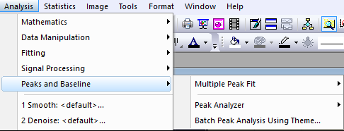
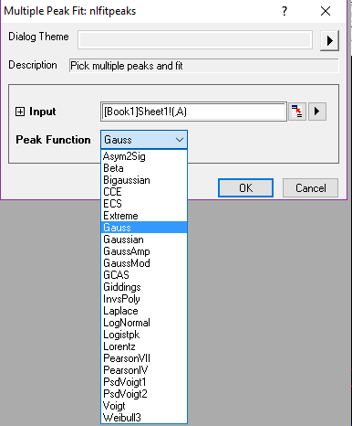
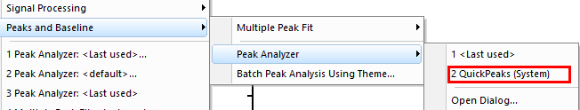
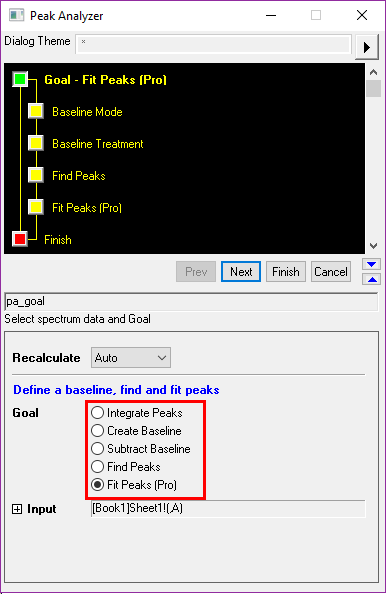
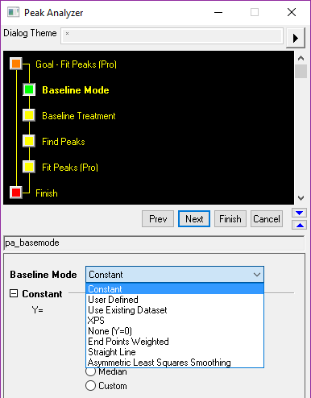

# Peaks And Baseline

<!-- TOC -->

- [Peaks And Baseline](#peaks-and-baseline)
    - [Peaks & Baseline/Multiple Peak Fit: 半自动](#peaks--baselinemultiple-peak-fit-半自动)
    - [Peaks & Baseline/Peak Analyzer/QuickPeaks: 全自动](#peaks--baselinepeak-analyzerquickpeaks-全自动)
    - [Peaks & Baseline/Peak Analyzer/OpenDialog](#peaks--baselinepeak-analyzeropendialog)

<!-- /TOC -->

主要用于光谱分析，寻找多峰

## Peaks & Baseline/Multiple Peak Fit: 半自动

双击峰顶，然后就可以了

## Peaks & Baseline/Peak Analyzer/QuickPeaks: 全自动

## Peaks & Baseline/Peak Analyzer/OpenDialog

[Fitting Multiple Peaks with Peak Analyzer](https://www.youtube.com/watch?v=Y8nVlO8z02o)

