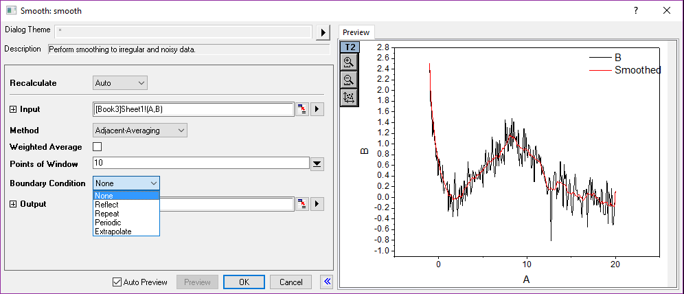
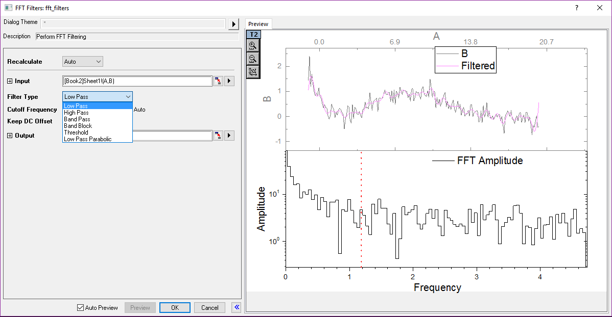
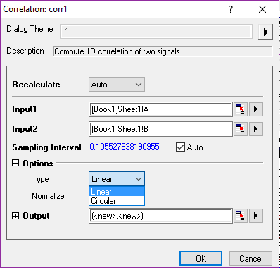

# Signal Processing

<!-- TOC -->

- [Signal Processing](#signal-processing)
    - [Signal Processing/Smooth](#signal-processingsmooth)
    - [Filter](#filter)
        - [Signal Processing/FFT Filters](#signal-processingfft-filters)
            - [频率调制的滤波方法](#频率调制的滤波方法)
            - [振幅调制的滤波方法](#振幅调制的滤波方法)
        - [Signal Processing/IIR Filter](#signal-processingiir-filter)
    - [Fourier Analysis](#fourier-analysis)
        - [Signal Processing/FFT/FFT…(Fast Fourier Transform)](#signal-processingfftfftfast-fourier-transform)
            - [原理](#原理)
            - [FFT in Origin](#fft-in-origin)
        - [Signal Processing/FFT/IFFT…](#signal-processingfftifft)
        - [Signal Processing/STFT…(Short Time Fourier Transform)](#signal-processingstftshort-time-fourier-transform)
    - [Signal Processing/Convolution](#signal-processingconvolution)
        - [Convolution原理](#convolution原理)
    - [Signal Processing/Coherence](#signal-processingcoherence)
    - [Signal Processing/Correlation](#signal-processingcorrelation)
    - [Signal Processing/Hilbert Transform](#signal-processinghilbert-transform)
    - [Signal Processing/Envelop](#signal-processingenvelop)
    - [Signal Processing/Decimation](#signal-processingdecimation)
    - [Signal Processing/Wavelet](#signal-processingwavelet)
        - [Signal Processing/Wavelet/Continuous Wavelet](#signal-processingwaveletcontinuous-wavelet)
        - [Signal Processing/Wavelet/Decompose](#signal-processingwaveletdecompose)
        - [Signal Processing/Wavelet/Reconstruction](#signal-processingwaveletreconstruction)
        - [Signal Processing/Wavelet/Multi-Scale DWT](#signal-processingwaveletmulti-scale-dwt)
        - [Signal Processing/Wavelet/denoise](#signal-processingwaveletdenoise)
        - [Signal Processing/Wavelet/Smooth](#signal-processingwaveletsmooth)

<!-- /TOC -->

## Signal Processing/Smooth

Adjacent-Averaging: 局部数据平均
>   
> Points of Window: value大, 平滑程度大

Savitzky-Golay: 局部数据多项式回归，一般操作首选这种操作
> 

Percentile Filter: 局部数据计算一个指定的分位值,将原始数据替换为该分位值,适合脉冲噪声; 
>   
> Percentile越小，越往下偏

FFT Filter: Fast Fourier Transform, 过滤高频信号实现曲线平滑
> Cutoff percentage: 越小,越平滑

Other Methods:
- Lowess:
- Loess:
- Binomial:

## Filter

- Fourier Transform: **时域**信号变换为**频域**信号
- Inverse Fourier Transform: **频域**信号变换为**时域**信号

$$
\begin{aligned}
&F(\omega)=\int_{-\infty}^{+\infty}{f(t)e^{-i\omega t}dt}, \text{Fourier transform}
\\\\
&f(t)=\frac{1}{2\pi}\int_{-\infty}^{+\infty}{F(\omega)e^{i\omega t}d\omega}, \text{Inverse Fourier Transform}
\end{aligned}
$$

标准过程：时域→频域(**Fourier Tansform**)，频域进行处理，频域→时域(**Inverse Fourier transform**)

对于离散数据点:

$$
\begin{aligned}
&f(t)\rightarrow f(n)
\\\\
&F(\omega)=\int_{-\infty}^{+\infty}{f(t)e^{-i\omega t}dt}\rightarrow F(k)=\sum_{n=0}^{N-1}{f(n)e^{-i\frac{2\pi}{N}nk}}
\\\\
&f(t)=\frac{1}{2\pi}\int_{-\infty}^{+\infty}{F(\omega)e^{i\omega t}d\omega}\rightarrow f(n)=\frac{1}{N}\sum_{k=0}^{N-1}{F(k)e^{i\frac{2\pi}{N}kn}}
\end{aligned}
$$

### Signal Processing/FFT Filters

#### 频率调制的滤波方法

<https://www.originlab.com/doc/X-Function/ref/fft_filters>

1. Low Pass: 低频通过
2. High Pass: 高频通过
3. Band Pass:范围内的通过
4. Band Block:范围外的通过

Cutoff Frequency: 和下图的红色纵线关联

#### 振幅调制的滤波方法

1. Threshhold: 和右下图横向的红线关联
1. Low Pass Parabolic: 比low-pass更为缓慢地下降

### Signal Processing/IIR Filter

(Infinite Impulse Response Filter), don't understand

## Fourier Analysis

### Signal Processing/FFT/FFT…(Fast Fourier Transform)

离散Fourier Transform当N增大时，运算量明显增大~$O(N^2)$, 而FFT可以解决这个问题

根据周期性，将长序列的离散Fourier Transform变成短序列的可以减少运算量

#### 原理

具体过程: 以8点的变换作为例子

$$
\begin{aligned}
&F_m(k)=F_{m-1}(k)+F_{m-1}(k+2^{m-1})W_N^\gamma, \text{m=1,2,...,L}
\\\\
&F_{m}(k+2^{m-1})=F_{m-1}(k)-F_{m-1}(k+2^{m-1})W_N^\gamma, \text{m=1,2,...,L}
\\\\
&\text{其中} [r]_2=[k]_2\cdot2^{L-m}
\\\\
&O(N\log_2N)
\end{aligned}
$$

#### FFT in Origin

其中:

$$
\begin{aligned}
&\text{MSA: } \frac{Re^2F(k)+Im^2F(k)}{N^2}\backsim k
\\\\
&\text{SSA: } \frac{Re^2F(k)+Im^2F(k)}{N}\backsim k
\\\\
&\text{TISA: } \frac{Re^2F(k)+Im^2F(k)}{\frac{N}{\tau_0}}\backsim k
\end{aligned}
$$

Plot tab中最常用的是Amplitude/Phase

### Signal Processing/FFT/IFFT…

> `*`表示取共轭序列

与FFT不同的地方仅仅在Undo Shift Input Data

先进行FFT, 再进行IFFT，只有当window, Factor, Shift Input Data一致时，信号才能被还原

### Signal Processing/STFT…(Short Time Fourier Transform)

dynamics analysis method, 分析非稳态信号(frequency is changing), FFT,IFFT只能得到稳态变换

$$
F(k;\tau)=\sum_{n=0}^{N-1}{f(n)\omega(\tau-n)e^{-i\frac{2\pi}{N}nk}}
$$

根据不确定原理，信号的频域特征和时域特征不可能同时得到，w越窄，时域分辨率高，频域分辨率低

## Signal Processing/Convolution

### Convolution原理

卷积的重要的物理意义是：一个函数在另一个函数上的加权叠加。

$$
\begin{aligned}
&\text{线性卷积: 序列在普通坐标的左移右移}
\\\\
&f_1(t)*f_2(t)=\int_{-\infty}^{+\infty}{f_1(\xi)f_2(t-\xi)d\xi}
\\\\
&\text{圆周卷积: 序列在环形坐标的逆时针，顺时针}
\\\\
&f_1(t)\circledast f_2(t)=\int_{-\infty}^{+\infty}{f_1(\xi)\tilde{f_2}(t-\xi)d\xi}
\\\\
&\text{离散卷积}
\\\\
&f_1(t)*f_2(t)=\int_{-\infty}^{+\infty}{f_1(\xi)f_2(t-\xi)d\xi}\rightarrow f_1(n)*f_2(n)=\sum_{\xi=0}^{N-1}{f_1(\xi)f_2(n-\xi)}
\\\\
&\text{卷积定理}
\\\\
&\mathscr{F}[f_1(n)*f_2(n)]=\mathscr{F}[f_1(n)]\cdot\mathscr{F}[f_2(n)]
\\\\
&f_1(n)*f_2(n)=\mathscr{F}^{-1}[\mathscr{F}[f_1(n)]\cdot\mathscr{F}[f_2(n)]]
\\\\
&f_1(n) =\mathscr{F}^{-1}[ \frac{\mathscr{F}[f_1(n) *f_2(n)]}{\mathscr{F}[f_2(n)]}] 

\end{aligned}
$$

其中的Fourier Transform, Inverse Fourier Transform采用的都是**FFT method**

## Signal Processing/Coherence

判断两个信号是否存在相同的频率成分

$$
\begin{aligned}
&F_1(k)=\mathscr{F}[f_1(n)], F_2(k)=\mathscr{F}[f_2(n)]
\\\\
&C(k)=\frac{|F_1^*(k)F_2(k)|^2}{F_1(k)F_1^*(k)\cdot F_2(k)F_2^*(k)}
\end{aligned}
$$

C(k)在[0,1], 值越大，一致性越强

## Signal Processing/Correlation

两个信号在时间延迟上的相似性(linear correlation, circle correlation)

Linear Correlation: 适合脉冲信号，归一化的r在[-1,1]，越接近两边，相关性越强

$$
\begin{aligned}
&F_1(k)=\mathscr{F}[f_1(n)], F_2(k)=\mathscr{F}[f_2(n)]
\\\\
&r(n)=\mathscr{F}^{-1}[F_1(k)F_2^*(k)]
\end{aligned}
$$

Circle correlation:适合周期性，重复性信号

## Signal Processing/Hilbert Transform

amplitude不变，phase旋转90°

保持变换后的信号和原始信号正交

$$
\begin{aligned}
&F(\tau)=\frac{1}{\pi}\int_{-\infty}^{+\infty}{f(t)\frac{1}{t-\tau}dt}
\\\\
&z(t)=f(t)+iF(t)
\end{aligned}
$$

## Signal Processing/Envelop

## Signal Processing/Decimation

Decimation is the process of reducing the sampling rate of a signal. It is usually used to reduce the size of the data. Origin supports two filters in the decimation tool, which are FIR filter and Moving Average filter.

## Signal Processing/Wavelet

Wavelet Transform:

$$
\begin{aligned}
&F(a,b)=\int_{-\infty}^{+\infty}{f(t)\psi^*(t;a,b)dt}
\\\\
&\psi(t;a,b)=\frac{1}{\sqrt{a}}\psi(\frac{t-b}{a})
\end{aligned}
$$

通过a,b对小波基函数的伸缩，平移操作，对信号进行多尺度的分析(小波变换能够自动适应信号的时频特性，可以聚焦到任意尺度，从而获得信号的所有细节，对于信号分析以及非稳态信号分析作用强大)
> a为伸缩因子，b为平移因子  
> 通过连续小波变换，可以得到信号在任意尺度，任何位置的频率信息

### Signal Processing/Wavelet/Continuous Wavelet

$$
\begin{aligned}
&\text{Morlet: } \psi(t)=\sqrt[4]{\frac{1}{\pi}}cos(kt)e^{-\frac{t^2}{2}}
\\\\
&\text{Dgauss: } \psi(t)=\sqrt[4]{\frac{\pi}{2}}\frac{d^p}{dt^p}e^{-t^2}
\\\\
&\text{MexHat: } \psi(t)=\frac{2}{\sqrt{3}}\cdot\sqrt[4]{\frac{1}{\pi}}(1-t^2)e^{-\frac{t^2}{2}}
\end{aligned}
$$

### Signal Processing/Wavelet/Decompose

对应于离散数据的小波变换

f(t)进行两个卷积，然后降低一半采样率，上面的Fa是轮廓，下面的Fd是细节;

低通和高通取决于小波基函数

### Signal Processing/Wavelet/Reconstruction

对应于离散数据的小波逆变换

### Signal Processing/Wavelet/Multi-Scale DWT

本质：多级wavelet decompose

### Signal Processing/Wavelet/denoise

通过多级的decompose, 得到一个近似信号和若干细节信号，处理细节信号(threshold filter)，然后逐级reconstruction，进行降噪

### Signal Processing/Wavelet/Smooth

通过多级的decompose, 得到一个近似信号和若干细节信号，处理细节信号(直接截断)，然后逐级reconstruction，进行smooth

