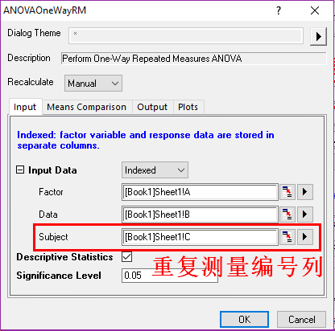

# Statistics

- [Statistics](#statistics)
    - [Descriptive Statistics](#descriptive-statistics)
        - [Statistics on Columns](#statistics-on-columns)
        - [Statistics on Rows](#statistics-on-rows)
        - [Cross Tabulation](#cross-tabulation)
        - [Correlation Coefficient](#correlation-coefficient)
        - [Partial Correlation Coefficient](#partial-correlation-coefficient)
        - [Grubbs' Test](#grubbs-test)
        - [Dixon's Q-Test](#dixons-q-test)
        - [Discrete Frequency](#discrete-frequency)
        - [Frequency Counts](#frequency-counts)
        - [2D frequency Counts](#2d-frequency-counts)
        - [Distribution Fit](#distribution-fit)
        - [Normality Test](#normality-test)
    - [Hypothesis Testing](#hypothesis-testing)
        - [理论(对于平均值)](#%E7%90%86%E8%AE%BA%E5%AF%B9%E4%BA%8E%E5%B9%B3%E5%9D%87%E5%80%BC)
            - [单样本数据](#%E5%8D%95%E6%A0%B7%E6%9C%AC%E6%95%B0%E6%8D%AE)
            - [双样本配对数据](#%E5%8F%8C%E6%A0%B7%E6%9C%AC%E9%85%8D%E5%AF%B9%E6%95%B0%E6%8D%AE)
            - [双样本独立数据](#%E5%8F%8C%E6%A0%B7%E6%9C%AC%E7%8B%AC%E7%AB%8B%E6%95%B0%E6%8D%AE)
        - [Testing in Origin](#testing-in-origin)
            - [One-Sample Test](#one-sample-test)
            - [Pair-Sample Test](#pair-sample-test)
            - [Two-Sample Test](#two-sample-test)
        - [理论(对于标准差) Test for Variance](#%E7%90%86%E8%AE%BA%E5%AF%B9%E4%BA%8E%E6%A0%87%E5%87%86%E5%B7%AE-test-for-variance)
            - [单样本数据Test for Variance](#%E5%8D%95%E6%A0%B7%E6%9C%AC%E6%95%B0%E6%8D%AEtest-for-variance)
            - [双样本数据Test for Variance](#%E5%8F%8C%E6%A0%B7%E6%9C%AC%E6%95%B0%E6%8D%AEtest-for-variance)
        - [Variance Test in Origin](#variance-test-in-origin)
            - [One-Sample Test for variance](#one-sample-test-for-variance)
            - [Two-Sample Test for variance](#two-sample-test-for-variance)
            - [One-Sample Proportion Test](#one-sample-proportion-test)
            - [Two-Sample Proportion Test](#two-sample-proportion-test)
            - [Test on Rows](#test-on-rows)
    - [AVOVA](#avova)
        - [One-Way ANOVA](#one-way-anova)
        - [Two-Way ANOVA](#two-way-anova)
        - [One-Way Repeated Measure ANOVA](#one-way-repeated-measure-anova)
        - [Two-Way Repeated Measure ANOVA](#two-way-repeated-measure-anova)
        - [Three-Way ANOVA](#three-way-anova)
    - [Nonparametric Tests](#nonparametric-tests)
        - [One-Sample Wilcoxon Signed Rank Test](#one-sample-wilcoxon-signed-rank-test)
        - [Pair-Sample Sign Test](#pair-sample-sign-test)
        - [Pair-Sample Wilcoxon Signed Rank Test](#pair-sample-wilcoxon-signed-rank-test)
        - [Two-Sample Kolmogorov-Smirnov Test](#two-sample-kolmogorov-smirnov-test)
        - [Mann-Whitney Test](#mann-whitney-test)
        - [Kruskal-Wallis  ANOVA](#kruskal-wallis-anova)
        - [Mood's Median Test](#moods-median-test)
        - [Friedman ANOVA](#friedman-anova)
        - [(NPH)K independent Samples](#nphk-independent-samples)
        - [(NPH)Paired Samples](#nphpaired-samples)
        - [(NPH)Two Independent Samples](#nphtwo-independent-samples)
    - [Survival Analysis](#survival-analysis)
        - [Kaplan-Meier Estimator](#kaplan-meier-estimator)
        - [Cox Model Estimator](#cox-model-estimator)
        - [Weibull Fit](#weibull-fit)
    - [Power & Sample Size](#power-sample-size)
        - [(PSS) One-Sample T-Test: there is no input data](#pss-one-sample-t-test-there-is-no-input-data)
        - [(PSS) Two-Sample T-Test](#pss-two-sample-t-test)
        - [(PSS) Paired-Sample T-Test](#pss-paired-sample-t-test)
        - [(PSS) One-Way ANOVA](#pss-one-way-anova)
        - [(PSS) One-Proportion Test](#pss-one-proportion-test)
        - [(PSS) Two-Proportion Test](#pss-two-proportion-test)
        - [(PSS) One-Variance Test](#pss-one-variance-test)
        - [(PSS) Two-Variance Test](#pss-two-variance-test)
    - [ROC Curve](#roc-curve)
        - [ROC Curve](#roc-curve)
    - [Multivariate Analysis](#multivariate-analysis)
        - [Principal Component Analysis](#principal-component-analysis)
        - [Partial Least Squares](#partial-least-squares)
        - [K-Means Cluster Analysis](#k-means-cluster-analysis)
        - [Hierarchical Cluster Analysis](#hierarchical-cluster-analysis)
        - [Discriminant Analysis](#discriminant-analysis)

## Descriptive Statistics

### Statistics on Columns

$$
\lambda=
\begin{cases}
n-1 \text{ ,DF}\\
n \text{ ,N}\\
w-1 \text{ ,WDF}\\
w \text{ ,WS}\\
w-\frac{\sum_{i=1}^{n}{w_i^2}}{w} \text{ ,WVR}
\end{cases}
$$

### Statistics on Rows

Just like the "Statistics on Columns"

### Cross Tabulation

It is widely used to analysis categorical data.

### Correlation Coefficient

$$
\begin{aligned}
&\text{Pearson:连续型正态数据}
\\\\
&r=\frac{cov(X,Y)}{\sigma_X\sigma_Y}=\frac{1}{n-1}\sum_{i=1}^{n}{(\frac{x_i-\bar{x}}{S_x})(\frac{y_i-\bar{y}}{S_y})}
\\\\
&\text{Spearman:有序数据，等间隔非正态数据}
\\\\
&r=1-\frac{6}{n(n^2-1)}rank^2(X,Y)\\
&=1-\frac{6}{n(n^2-1)}\sum_{i=1}^n{[d(x_i,y_m)-d(x_i,y_n)]^2}
\\\\
&\text{Kendall:有序数据，等间隔非正态数据}
\\\\
&r=\frac{2}{n(n-1)}[rank_+(X,Y)-rank_-(X,Y)]\\
&=\frac{1}{n(n-1)}\sum_{i=1}^n{\sum_{j=1}^n{sgn[d(x_i,y_m)-d(x_n,y_m)]\cdot sgn[d(x_i,y_j)-d(x_n,y_j)]}}
\end{aligned}
$$

### Partial Correlation Coefficient

Partial correlation coefficient is used to describe the relation between two variables in the presence of controlling variables.

多元关系中为了分析线性相关系数，controlloing variables就是被控制的变量

### Grubbs' Test

[Grubbs' Test](http://www.originlab.com/doc/Origin-Help/Grubbs-Test-Dialog)

### Dixon's Q-Test

[Dixon's Q-Test](https://www.originlab.com/doc/Origin-Help/DixonsQ-Test-Dialog)

### Discrete Frequency

### Frequency Counts

### 2D frequency Counts

### Distribution Fit

examine the distribution of their data, and estimate parameters for the distribution

### Normality Test

$$
\begin{aligned}
\text{Shapiro-Wilk: } \\
&W=\frac{(\sum_{i=1}^n{a_ix_i})^2}{\sum_{i=1}^n{(x_i-\bar{x})^2}}
\\\\
&H_0:W>W_\alpha \text{ ;数据具有正态性}\\
&H_1:W\leqslant W_\alpha \text{ ;数据不具有正态性}
\\\\
\text{Kolmogorov-Smirnov: }\\
&D=\max|p\{X\leqslant x\}-\int_{-\infty}^{x}{\frac{1}{\sigma\sqrt{2\pi}}e^{-\frac{(\xi-\mu)^2}{2\sigma2}}d\xi}|
\\\\
&H_0: D\leqslant D_\alpha \text{ ;数据具有正态性}\\
&H_1: D>D_\alpha \text{ ;数据不具有正态性}
\\\\
\text{Lilliefors: }\\
&\text{Modified edition of 'Kolmogorov-Smirnov'}
\end{aligned}
$$

## Hypothesis Testing

t-Test都是normal distribution

### 理论(对于平均值)

#### 单样本数据

$$
\begin{aligned}
\text{单侧检验:}\\
&H_0: \mu\leqslant\mu_0, H_1: \mu>\mu_0
\\
&H_0: \mu\geqslant\mu_0, H_1: \mu<\mu_0
\\\\
\text{双侧检验:}\\
&H_0: \mu=\mu_0, H_1: \mu\ne\mu_0
\\\\
&t=\frac{\bar{x}-\mu_0}{\frac{s}{\sqrt{n}}}=\frac{\bar{x}-\mu_0}{\frac{1}{\sqrt{n}}\sqrt{\sum_{i=1}^n{\frac{(x_i-\bar{x})^2}{n-1}}}}, \text{其中} \bar{x}=\frac{1}{n}\sum_{i=1}^{n}{x_i}
\\
&H_0: t\leqslant t_\alpha, \mu\leqslant\mu_0; H_1: t>t_\alpha,\mu>\mu_0
\\
&H_0: t\geqslant -t_\alpha, \mu\geqslant\mu_0; H_1: t< -t_\alpha,\mu<\mu_0
\\
&H_0: |t|\leqslant t_{\alpha/2}, \mu=\mu_0; H_1: |t|>t_{\alpha/2},\mu\ne\mu_0
\\\\
&p=p(t>t_\alpha)=\frac{\Gamma(\frac{n+1}{2})}{\sqrt{n\pi}\cdot\Gamma(\frac{n}{2})}[\frac{1}{2}-\int_{0}^{t_\alpha}{(1+\frac{t^2}{n})^{-\frac{n+1}{2}}dt}], x\in[\bar{x}-t_{\alpha/2}\frac{s}{\sqrt{n}},\bar{x}+t_{\alpha/2}\frac{s}{\sqrt{n}}]
\end{aligned}
$$

#### 双样本配对数据

比如同一个测试对象在技术处理前后得到的数据

$$
\begin{aligned}
\text{单侧检验:}\\
&H_0: \mu_1-\mu_2\leqslant\mu_d; H_1: \mu_1-\mu_2>\mu_d
\\
&H_0: \mu_1-\mu_2\geqslant\mu_d; H_1: \mu_1-\mu_2<\mu_d
\\\\
\text{双侧检验:}\\
&H_0: \mu_1-\mu_2=\mu_d; H_1: \mu_1-\mu_2\ne\mu_d
\\\\
&t=\frac{\bar{d}-\mu_d}{\frac{s_d}{\sqrt{n}}}, \text{其中}\bar{d}=\frac{1}{n}\sum_{i=1}^n{d_i}=\frac{1}{n}\sum_{i=1}^n{(x_{1i}-x_{2i})}, s_d=\sqrt{\sum_{i=1}^n{\frac{(d_i-\bar{d})^2}{n-1}}}
\\\\
&H_0: t\leqslant t_\alpha, \mu_1-\mu_2\leqslant\mu_d; H_1: t>t_\alpha,\mu_1-\mu_2>\mu_d
\\
&H_0: t\geqslant -t_\alpha, \mu_1-\mu_2\geqslant\mu_d; H_1: t< -t_\alpha, \mu_1-\mu_2<\mu_d
\\
&H_0: |t|\leqslant t_{\alpha/2}, \mu_1-\mu_2=\mu_d; H_1:|t|>t_{\alpha/2}, \mu_1-\mu_2\ne\mu_d
\end{aligned}
$$

#### 双样本独立数据

同一测试对象平行重复的测量

$$
\begin{aligned}
\text{单侧检验:}\\
&H_0: \mu_1-\mu_2\leqslant\mu_d; H_1: \mu_1-\mu_2>\mu_d
\\
&H_0: \mu_1-\mu_2\geqslant\mu_d; H_1: \mu_1-\mu_2<\mu_d
\\\\
\text{双侧检验:}\\
&H_0: \mu_1-\mu_2=\mu_d; H_1: \mu_1-\mu_2\ne\mu_d
\\\\
&t=\frac{\bar{d}-\mu_d}{\frac{s_d}{\sqrt{n}}}, \text{其中}\bar{d}=\frac{1}{n}\sum_{i=1}^n{d_i}=\frac{1}{n}\sum_{i=1}^n{(x_{1i}-x_{2i})}, s_d=\sqrt{\sum_{i=1}^n{\frac{(d_i-\bar{d})^2}{n-1}}}
\\\\
&H_0: t\leqslant t_\alpha, \mu_1-\mu_2\leqslant\mu_d; H_1: t>t_\alpha,\mu_1-\mu_2>\mu_d
\\
&H_0: t\geqslant -t_\alpha, \mu_1-\mu_2\geqslant\mu_d; H_1: t< -t_\alpha, \mu_1-\mu_2<\mu_d
\\
&H_0: |t|\leqslant t_{\alpha/2}, \mu_1-\mu_2=\mu_d; H_1:|t|>t_{\alpha/2}, \mu_1-\mu_2\ne\mu_d
\end{aligned}
$$

### Testing in Origin

上面三个分别对应了

- One-Sample Test;
- Pair-Sample Test;
- Two-Sample Test;

#### One-Sample Test

确定样本的mean是不是符合给定分布的mean

#### Pair-Sample Test

#### Two-Sample Test

Attention:如果采用indexed, 里面只有两个值(比如A,B)

### 理论(对于标准差) Test for Variance

#### 单样本数据Test for Variance

$$
\begin{aligned}
\text{单侧检验:}\\
&H_0: \sigma\leqslant\sigma_0; H_1: \sigma>\sigma_0
\\
&H_0: \sigma\geqslant\sigma_0; H_1: \sigma<\sigma_0
\\
\text{双侧检验:}\\
&H_0: \sigma=\sigma_0; H_1: \sigma\ne\sigma_0
\\\\
&\chi^2=\frac{(n-1)s^2}{\sigma_0^2}=\frac{\sum_{i=1}^n{(x_i-\bar{x})^2}}{\sigma_0^2}, \text{其中}\bar{x}=\frac{1}{n}\sum_{i=1}^n{x_i}
\\
&H_0: \chi^2\leqslant\chi_\alpha^2,\sigma\leqslant\sigma_0; H_1: \chi^2>\chi_\alpha^2,\sigma>\sigma_0
\\
&H_0: \chi^2\geqslant-\chi_\alpha^2,\sigma\geqslant\sigma_0; H_1: \chi^2<-\chi_\alpha^2,\sigma<\sigma_0
\\
&H_0: |\chi^2|\leqslant\chi_{\alpha/2}^2,\sigma=\sigma_0; H_1: |\chi^2|>\chi_{\alpha/2}^2,\sigma\ne\sigma_0
\\\\
&p=p(\chi^2>\chi_\alpha^2)=\frac{\frac{1}{2}^{\frac{n}{2}}}{\Gamma(\frac{n}{2})}[1-\int_0^{\chi_\alpha^2}{\chi^{\frac{n}{2}-1}e^{-\frac{\chi}{2}}d\chi}]
\\
&\sigma\in[\sqrt{\frac{(n-1)s^2}{\chi_{\alpha/2}^2}},\sqrt{\frac{(n-1)s^2}{\chi_{1-\frac{\alpha}{2}}^2}}]
\end{aligned}
$$

#### 双样本数据Test for Variance

$$
\begin{aligned}
\text{单侧检验}\\
&H_0: \frac{\sigma_1^2}{\sigma_2^2}\leqslant1; H_1: \frac{\sigma_1^2}{\sigma_2^2}>1
\\
&H_0: \frac{\sigma_1^2}{\sigma_2^2}\geqslant1; H_1: \frac{\sigma_1^2}{\sigma_2^2}<1
\\
\text{双侧检验}\\
&H_0: \frac{\sigma_1^2}{\sigma_2^2}=1; H_1: \frac{\sigma_1^2}{\sigma_2^2}\ne1
\\\\
&p=p(F>F_\alpha)=\frac{\Gamma(\frac{n_1+n_2}{2})(\frac{n_1}{n_2})^{\frac{n_1}{2}}}{\Gamma(\frac{n_1}{2})\Gamma(\frac{n_2}{2})}[1-\int_0^{F_\alpha}{F^{\frac{n_1}{2}-1}(1+\frac{n_1}{n_2}F)^{-\frac{n_1+n_2}{2}}dF}]
\\
&\frac{\sigma_1^2}{\sigma_2^2}\in[\frac{1}{F_{1-\alpha/2}}\frac{s_1^2}{s_2^2},\frac{1}{F_{\alpha/2}}\frac{s_1^2}{s_2^2}]
\end{aligned}
$$

### Variance Test in Origin

#### One-Sample Test for variance

确定样本的方差是不是符合给定分布的方差

#### Two-Sample Test for variance

Attention the 'Input Data Form'

#### One-Sample Proportion Test

determines whether or not an observed proportion is equal to a pre-specified proportion.

#### Two-Sample Proportion Test

proportional representation of two groups in a sample under study

#### Test on Rows

compare the means of two samples, which are stored in rows

- Two-Sample t-test on Rows
- Pair-Sample t-test on Rows

## AVOVA

ANOVA = Analysis of Variance

examine the variance of a dependent variable

### One-Way ANOVA

AVOVA report Table:

### Two-Way ANOVA

Interactions: two factor have interaction or not;

AVOVA report Table:

### One-Way Repeated Measure ANOVA

### Two-Way Repeated Measure ANOVA

### Three-Way ANOVA

just add a factor

## Nonparametric Tests

前面的参数检验(Hypothesis Testing, ANOVA)假设数据服从正态分布;
Nonparametric Tests不知道数据的特征

### One-Sample Wilcoxon Signed Rank Test

- Test Median;
- 假设数据对称;

### Pair-Sample Sign Test

检验两个样本服从同一个分布

### Pair-Sample Wilcoxon Signed Rank Test

检验两个配对样本的中位数是否相等

### Two-Sample Kolmogorov-Smirnov Test

determine whether the two are drawn from the same continuous distribution.

检验两组数据是否存在局部位置差异，在经验分布函数上是否一致

$$
D=\sqrt{\frac{n_1+n_2}{n_1n_2}} \max|F(X)-G(Y)|
$$

### Mann-Whitney Test

两组数据是否服从同一个分布

$$
U=rank(X,Y)-\frac{n_1(n_1+1)}{2}-{n_2(n_2+1)}{2}
$$

### Kruskal-Wallis  ANOVA

determine whether three or more independent samples are taken from the same distribution

检验多个样本的中位数是否相等

区别在于Group Range不止两个值，可以是多个值

$$
\chi^2=\frac{12}{\sum_{i=1}^t{n_i(\sum_{i=1}^t{n_i+1})}}\sum_{i=1}^t{\sum_{j=1}^{n_i}{\frac{rank^2(X_i,X_j)}{x_{ij}}-3(\sum_{i=1}^t{n_i+1})}}
$$

### Mood's Median Test

检验多个样本的中位数是否相等

### Friedman ANOVA

检验多样本配对数据是否服从同一个分布，数据满足平衡设计(每个样本具有相同的level数目,每个level只有一个数据)，也就是数据集的因素水平数满足定距性或者正交性

### (NPH)K independent Samples

### (NPH)Paired Samples

### (NPH)Two Independent Samples

## Survival Analysis

研究必然事件随时间发生规律的方法(获得事件的时间特征)

### Kaplan-Meier Estimator

给出样本的存活函数，可以用于计算半衰期等等

$$
\begin{aligned}
&S(t)=\prod_{i=1}^{j}{\frac{n_i-n_i^*}{n_i}}\\
&\text{其中}n_i\text{为}t_i\text{时刻样本的容量}\\
&n_i^*\text{为}t_i\text{时刻发生必然事件和发生截断的样本的容量}
\end{aligned}
$$

没有截断数据Censoring Value的，不用存活分析;不要同时勾选这两项

### Cox Model Estimator

比例风险模型，对风险函数的回归分析，预测风险随x的变化

$$
\lambda(X,t)=\lambda_0(t)e^{X\vec{\beta}+\vec{\omega}}
$$

### Weibull Fit

参数分析方法

$$
S(t)=e^{-(\frac{t-\tau}{\sigma})^c}
$$

## Power & Sample Size

对假设检验结果进行性能评价的方法

$$
\begin{aligned}
&\text{A错误: } p_A=p\{\text{拒绝}H_0|H_0\text{真}\}\leqslant\alpha\\
&\text{B错误: } p_B=p\{\text{接受}H_0|H_1\text{真}\}\leqslant\beta\\
\end{aligned}
$$

功效分析可以评价范两类错误的概率有多大(也就是评价假设检验的性能好坏)

功效:

$$
p=p\{\text{接受}H_0|H_0\text{真}\}\geqslant1-\beta
$$

- 样本容量越大，功效越大，推断越准确
- 功效分析：给定容量，假设检验能够达到的最大功效值
- 容量分析：达到给定功效，所需要的最小样本容量

### (PSS) One-Sample T-Test: there is no input data

### (PSS) Two-Sample T-Test

### (PSS) Paired-Sample T-Test

### (PSS) One-Way ANOVA

### (PSS) One-Proportion Test

determine the power of a one sample proportion test given the sample size or the sample size required to obtain a specified power for one sample proportion test

### (PSS) Two-Proportion Test

determine the power of a two-sample proportion test given the sample size or the sample size required to obtain a specified power for two-sample proportion test

### (PSS) One-Variance Test

determine the power of a one-sample variance test given the sample size or the sample size required to obtain a specified power for one-sample variance test

### (PSS) Two-Variance Test

determine the power of a two-sample variance test given the sample size or the sample size required to obtain a specified power for two-sample variance test

## ROC Curve

The **Receiver Operating Characteristic** (ROC) Curve is used to represent the trade-off between the false-positive and true positive rates for every possible cutoff value.

试验的灵敏度与特异度的关系曲线，用于二值判别效果的分析

二值判别:

$$
\begin{aligned}
\text{真阳性:\ }n_{TP}=\frac{\text{判别为阳性的数量}}{\text{样本中实际为阳性的数量}}\\\\
\text{假阳性:\ }n_{FP}=\frac{\text{判别为阳性的数量}}{\text{样本中实际为阴性的数量}}\\\\
\text{真阴性:\ }n_{TN}=\frac{\text{判别为阴性的数量}}{\text{样本中实际为阴性的数量}}\\\\
\text{假阴性:\ }n_{FN}=\frac{\text{判别为阴性的数量}}{\text{样本中实际为阳性的数量}}
\\\\
\text{灵敏度:\ }r_{TP}=\frac{n_{TP}}{n_{TP}+n_{FN}}\\
\text{特异度:\ }r_{TN}=\frac{n_{TN}}{n_{TN}+n_{FP}}
\end{aligned}
$$

ROC曲线: $\text{以}1-r_{TN}\text{为}x\text{轴,}r_{TP}\text{为}y\text{轴}$

### ROC Curve

ROC越往左上方偏，效果越好，曲线的面积表示试验判别能力的大小，下图的直线效果最差，表示判别阳性和阴性的效果一样，没有统计学意义

## Multivariate Analysis

### Principal Component Analysis

在用统计分析方法研究多变量的课题时，变量个数太多就会增加课题的复杂性。人们自然希望变量个数较少而得到的信息较多。在很多情形，变量之间是有一定的相关关系的，当两个变量之间有一定相关关系时，可以解释为这两个变量反映此课题的信息有一定的重叠。主成分分析是对于原先提出的所有变量，将重复的变量（关系紧密的变量）删去多余，建立尽可能少的新变量，使得这些新变量是两两不相关的，而且这些新变量在反映课题的信息方面尽可能保持原有的信息。

### Partial Least Squares

combines features of principal components analysis and multiple regression

### K-Means Cluster Analysis

used to classify observations through K number of clusters

### Hierarchical Cluster Analysis

primary statistical method for finding relatively homogeneous clusters of cases based on measured characteristics

### Discriminant Analysis

distinguish distinct sets of observations and allocate new observations to previously defined groups

