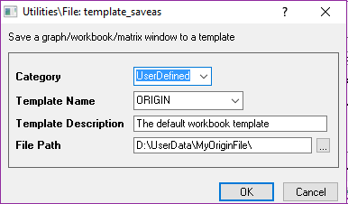
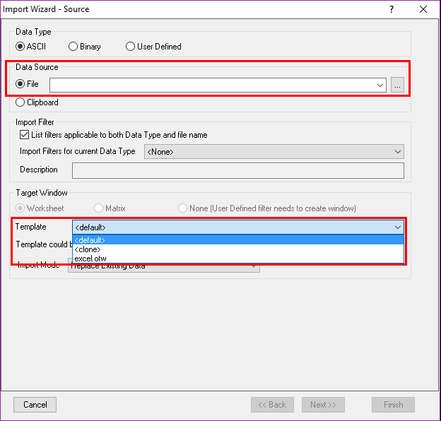
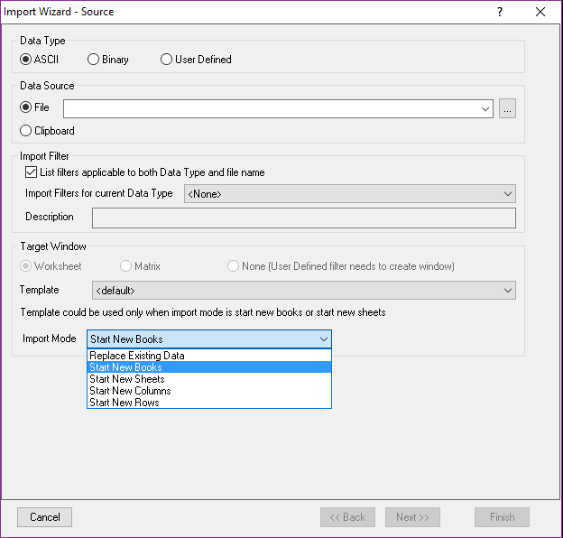

# Origin Template

- [Origin Template](#origin-template)
    - [一组数据的分析模板](#%E4%B8%80%E7%BB%84%E6%95%B0%E6%8D%AE%E7%9A%84%E5%88%86%E6%9E%90%E6%A8%A1%E6%9D%BF)
    - [利用Import Wizard批处理数据](#%E5%88%A9%E7%94%A8import-wizard%E6%89%B9%E5%A4%84%E7%90%86%E6%95%B0%E6%8D%AE)

建立一个分析模板，然后导入一个数据之后，自动进行计算

如果要批处理一堆数据，要用import wizard

## 一组数据的分析模板

1. 找一组数据，进行处理(e.g.Fitting)
1. 清空数据(clear)
1. File/Save Template As

    
1. 新的工程中，Recent Books中找到上面的模板
1. 导入数据进行处理

## 利用Import Wizard批处理数据

1. File/Import/Import Wizard

    
1. 选择多个文件，并且选择刚才的Template
1. 选择Start New books

    
1. finish