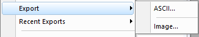

# Origin Image

- [Origin Image](#origin-image)
    - [Image/Adjustments](#imageadjustments)
    - [Image/Arithmetic Transform](#imagearithmetic-transform)
    - [Image/Conversion](#imageconversion)
    - [Image/Geometric Transform](#imagegeometric-transform)
    - [Image/Spatial Filters](#imagespatial-filters)
    - [Export](#export)
    - [数字图像处理](#%E6%95%B0%E5%AD%97%E5%9B%BE%E5%83%8F%E5%A4%84%E7%90%86)

For Bitmap

- single channel bitmap(greyscale)
- 3-channel bitmap(RGB)

File/Import/Image as Matrix;

If there isn't the menu, File/Import/Add\Remove File types to change

View Data Mode:

View/Image Mode:

## Image/Adjustments

## Image/Arithmetic Transform

- Morphological Filter: only for grayscale picture
- Subtract interpolated Background: only for grayscale picture

## Image/Conversion

Convert to Image: only for matirx

## Image/Geometric Transform

## Image/Spatial Filters

## Export

When finish the Image operation, need to export the image

And check the 'Show Options Dialog'

And there are some settings

## 数字图像处理

图像处理的目的：

- 提高图像的视感质量，比如亮度、彩色变换，增强、抑制某些成分，几何变换
- 提取图像中所包含的某些特征或特殊信息。提取特征或者信息的过程是模式识别或计算机视觉的预处理。提取的特征包括：频域特征、灰度或者颜色特征、边界特征、区域特征、纹理特征、形状特征、拓扑特征、关系结构等。
- 图像数据的变换、编码、压缩。便于图像的存储与传输

图像处理工具分为3类：

- 包括各种正交变换和图像滤波等方法。共同点是将图像变换到其他域(频域)中进行处理(比如滤波)，再变回到原来的空间(域)中
- 直接在空间域中处理图像。比如各种统计方法、微分方法等
- 数学形态学运算，是建立在积分几何和随机集合论的基础上的运算

Origind的图像分析：

- Analysis/Histogram
- Plot/Profiles/Image
- command window中输入imgInfo