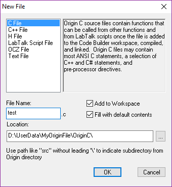
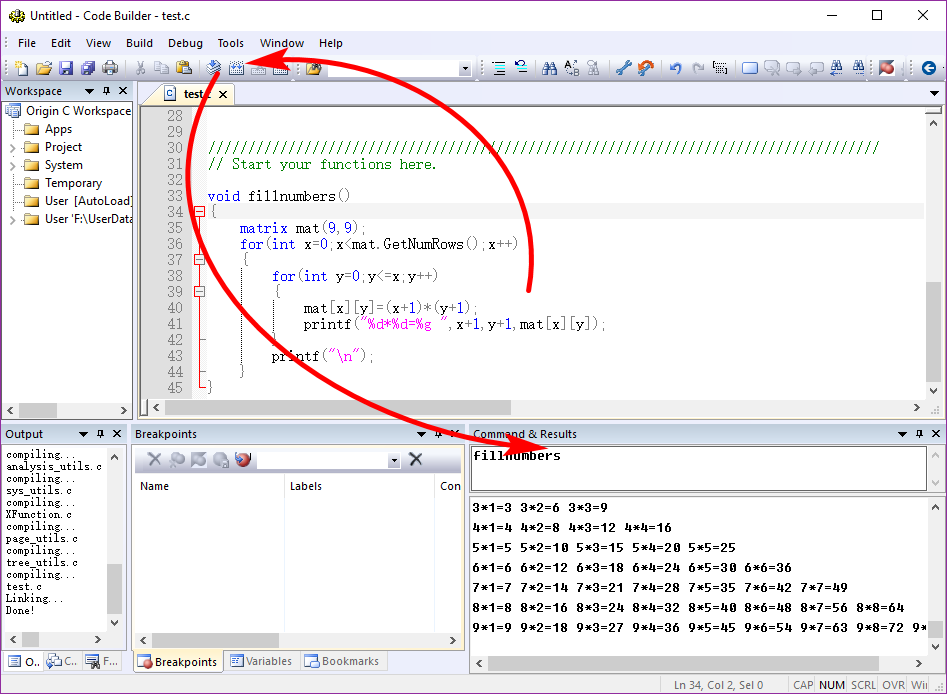
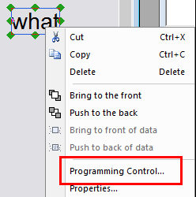
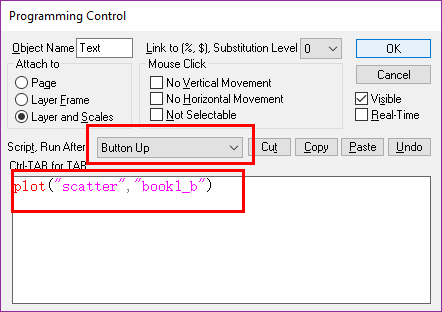
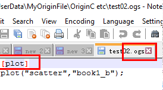
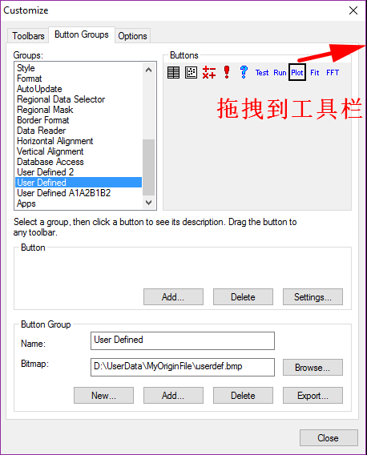
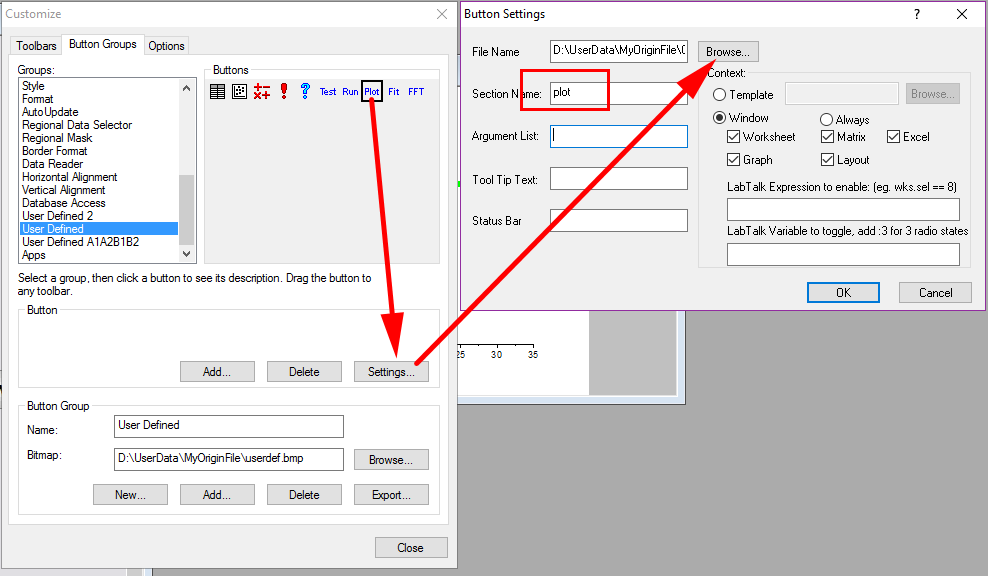
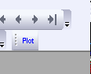

# Origin C

<!-- TOC -->

- [Origin C](#origin-c)
    - [Example: 输出乘法表](#example-输出乘法表)
    - [Example: 自定义按钮](#example-自定义按钮)
    - [Example: 自定义工具栏按钮](#example-自定义工具栏按钮)

<!-- /TOC -->

OriginC处理大量运算时，速度较快: View/Code Builder

OriginC vs C:
- Origin C不支持C的main函数
- OriginC不支持2维以上的数组，二维数组用matrix代替`matrix<int> myMatrix(4,3)`
> 

## Example: 输出乘法表

```c
//test.c
#include <Origin.h>

void fillnumbers()
{
    matrix mat(9,9);
    for(int x=0;x<mat.GetNumRows();x++)
    {
        for(int y=0;y<=x;y++)
        {
            mat[x][y]=(x+1)*(y+1);
            printf("%d*%d=%g ",x+1,y+1,mat[x][y]);//注意%g
        }
        printf("\n");
    }
}
```

> 

## Example: 自定义按钮

```c
//customBtn.c
// Start your functions here.
void plot(string strTemplate, string strData)
{
	GraphPage grph;
	BOOL bOK=grph.Create(strTemplate,CREATE_VISIBLE);
	if(!bOK)
		return;
	GraphLayer grlay=grph.Layers(0);
	Curve cv(strData);
	int nplot=grlay.AddPlot(cv);
	if(nplot>=0)
	{
		grlay.DataPlots(nplot).SetColor(2,TRUE);
		grlay.Rescale();
	}
}
```

Add a text to the workbook, right-click, **Programming Control**
> 
>   
> 

## Example: 自定义工具栏按钮

New a ogs file:
> 

View/Toolbar:
> 
> 
> 

Tip: 对于菜单栏的menu, 按住Ctrl +Shift同时点击，自动跳转到对应的C代码