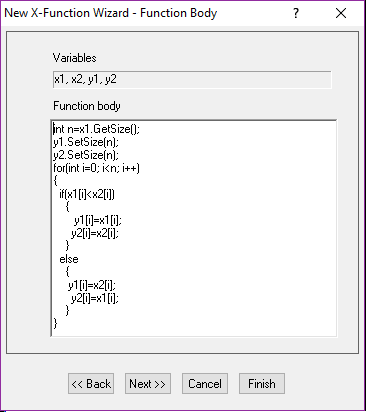
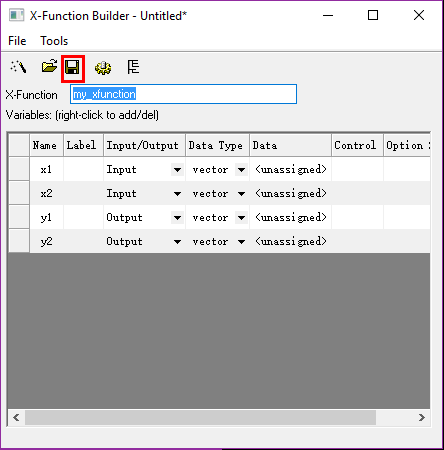
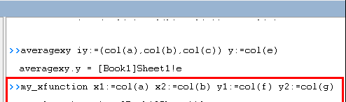

# With Other Math program

<!-- TOC -->

- [With Other Math program](#with-other-math-program)
    - [with Matlab](#with-matlab)
    - [with Mathematica](#with-mathematica)
    - [with LabView](#with-labview)

<!-- /TOC -->

## with Matlab

Origin可以直接导入MATLAB的.mat文件:File/Import/Matlab

Tools/MATLAB console: 可以在不打开MATLAB的基础上，调用kernel

数据交换: Tool/MATLAB console
- Pr: origin's real matrix to matlab;
- Gr: matlab's real matrix to origin;

- Pc: origin's complex matrix to matlab;
- Gc: matlab's complex matrix to origin;

- Pwr: origin workbook to matlab

    Pwr [Book1]Sheet1!col(A) P1

    P1 is the variable in matlab
- Pwc: origin workbook complex data to matlab

- Pws: origin workbook string to matlab

- Gwkspace m: matlab all variables to origin's matrix

- Gwkspace w:matlab all variables to origin's workbook

## with Mathematica

Tools/Mathematica link(choose the Kernel)

## with LabView

Tools/Copy Origin Sub-VI to LabView

## Origin Extension

[Origin Extension](https://www.originlab.com/fileexchange/)

比如，给出曲线的切线 <http://www.originlab.com/fileExchange/details.aspx?fid=227>

## xFunction

xFunction本质：已经编译好的OriginC程序
> 自己写的originC程序编译之后，可以在IDE的command&result中调用，或者在scriptwindow中调用，或者在set value对话框调用  
> 大量的数据采用x-function,少量的数据还是用点击

```bash
# window/command window中输入
>>averagexy iy:=(col(a),col(b),col(c)) y:=col(e)
```

Tool/X-Function Builder: 判断两个数大小
> 
> 

Now in the Command window, using my xfunction
> 