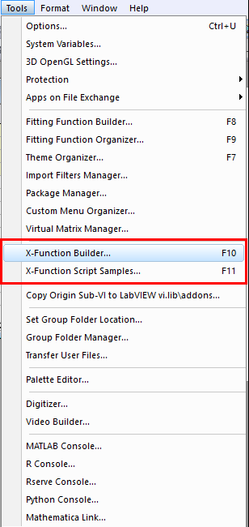

# xFunction

- [xFunction](#xfunction)

本质：已经编译好的C程序

自己写的originC程序编译之后，可以在IDE的command&result中调用，或者在scriptwindow中调用，或者在set value对话框调用

`Alt+3` to open **Command Window**

```bash
>>averagexy iy:=(col(a),col(b),col(c)) y:=col(e)
```

大量的数据采用x-function,少量的数据还是用点击



X-Function Builder:


Now in the Command window, using my xfunction

